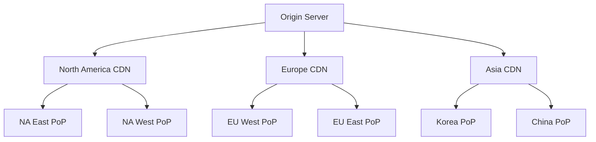

# CDN Infrastructure

## Overview

Blizzard's Content Delivery Network (CDN) infrastructure distributes game content globally using multiple CDN providers and a hierarchical file organization system optimized for efficient content delivery.

## CDN Providers

### Primary CDN Networks

| Provider | Hostname Pattern | Regions | Notes |
|----------|-----------------|---------|-------|
| Level3/Lumen | level3.blizzard.com | Global | Primary CDN |
| EdgeCast/Verizon | edgecast.blizzard.com | Global | Secondary CDN |
| Akamai | ak.blizzard.com | Global | High-traffic regions |
| Fastly | fastly.blizzard.com | Global | Modern CDN |
| CloudFlare | cf.blizzard.com | Global | Edge locations |

### Regional CDN Mapping

```
US: level3.blizzard.com, edgecast.blizzard.com
EU: level3.blizzard.com, edgecast.blizzard.com  
KR: blizzard.nefficient.co.kr, blizzard.kyrasouth.com
CN: client04.pdl.wow.battlenet.com.cn
```

### Fallback CDNs

Community-maintained mirrors:
- `http://cdn.arctium.tools/`
- `https://tact.mirror.reliquaryhq.com/`

## URL Structure

### Base URL Format

```
{protocol}://{hostname}/{path}/{type}/{hash_prefix}/{hash}
```

### Path Components

1. **Protocol**: `http` or `https`
2. **Hostname**: CDN provider domain
3. **Path**: Product-specific path (e.g., `tpr/wow`)
4. **Type**: Content type (`config`, `data`, `patch`)
5. **Hash Prefix**: First 4 hex characters as 2-level directory
6. **Hash**: Full content hash

### Examples

```
# Configuration file
http://level3.blizzard.com/tpr/wow/config/ab/c1/abc123def4567890...

# Data file
http://edgecast.blizzard.com/tpr/wow/data/12/34/1234567890abcdef...

# Patch file
http://level3.blizzard.com/tpr/wow/patch/fe/dc/fedcba0987654321...
```

## File Organization

### Hash-Based Paths

Files are organized using their content hash for even distribution:

```python
def get_cdn_path(hash, type):
    # Extract prefix for directory structure
    prefix1 = hash[0:2]  # First 2 hex chars
    prefix2 = hash[2:4]  # Next 2 hex chars
    
    # Construct path
    return f"{type}/{prefix1}/{prefix2}/{hash}"
```

### Directory Structure

```
CDN Root/
├── config/                 # Configuration files
│   ├── 00/
│   │   ├── 00/
│   │   ├── 01/
│   │   └── ...ff/
│   ├── 01/
│   └── ...ff/
├── data/                   # Game content
│   └── [same structure]
└── patch/                  # Update files
    └── [same structure]
```

### File Types

| Type | Path | Content | Format |
|------|------|---------|--------|
| Config | /config/ | Build configs, CDN configs | Text/BPSV |
| Data | /data/ | Game files, archives | BLTE |
| Patch | /patch/ | Delta updates | BLTE/ZBSDIFF |
| Index | /data/*.index | Archive indices | Binary |

## Content Distribution

### Geographic Distribution



### Edge Locations

Major Points of Presence (PoPs):
- **North America**: Los Angeles, Chicago, New York, Dallas
- **Europe**: Frankfurt, London, Paris, Amsterdam
- **Asia**: Seoul, Tokyo, Singapore, Sydney
- **China**: Beijing, Shanghai (separate infrastructure)

## Request Handling

### Request Flow

```python
def request_file(hash, type):
    # 1. Select CDN
    cdn = select_optimal_cdn()
    
    # 2. Build URL
    url = build_cdn_url(cdn, hash, type)
    
    # 3. Add headers
    headers = {
        'User-Agent': 'Blizzard Agent',
        'Accept-Encoding': 'gzip, deflate',
        'Connection': 'keep-alive'
    }
    
    # 4. Make request
    response = http_get(url, headers)
    
    # 5. Handle response
    if response.status == 200:
        return response.content
    elif response.status == 404:
        return try_fallback_cdn(hash, type)
    else:
        raise CDNError(response.status)
```

### CDN Selection Algorithm

```python
def select_optimal_cdn():
    cdns = get_available_cdns()
    
    # Sort by priority
    cdns.sort(key=lambda c: (
        c.latency,           # Lowest latency first
        c.load,              # Least loaded
        c.reliability        # Most reliable
    ))
    
    return cdns[0]
```

### Load Balancing

```python
class CDNLoadBalancer:
    def __init__(self, cdns):
        self.cdns = cdns
        self.weights = self.calculate_weights()
    
    def select(self):
        # Weighted random selection
        total = sum(self.weights.values())
        r = random.uniform(0, total)
        
        cumulative = 0
        for cdn, weight in self.weights.items():
            cumulative += weight
            if r <= cumulative:
                return cdn
```

## Performance Optimization

### Connection Pooling

```python
class ConnectionPool:
    def __init__(self, max_connections=10):
        self.pools = {}  # Per-host pools
        self.max_connections = max_connections
    
    def get_connection(self, host):
        if host not in self.pools:
            self.pools[host] = []
        
        pool = self.pools[host]
        
        # Reuse existing connection
        for conn in pool:
            if not conn.in_use:
                conn.in_use = True
                return conn
        
        # Create new if under limit
        if len(pool) < self.max_connections:
            conn = create_connection(host)
            pool.append(conn)
            return conn
        
        # Wait for available connection
        return wait_for_connection(pool)
```

### Parallel Downloads

```python
async def parallel_download(files, max_concurrent=5):
    semaphore = asyncio.Semaphore(max_concurrent)
    
    async def download_with_limit(file):
        async with semaphore:
            return await download_file(file)
    
    tasks = [download_with_limit(f) for f in files]
    return await asyncio.gather(*tasks)
```

### Bandwidth Management

```python
class BandwidthThrottler:
    def __init__(self, max_bytes_per_second):
        self.max_rate = max_bytes_per_second
        self.last_check = time.time()
        self.bytes_sent = 0
    
    def throttle(self, bytes_to_send):
        elapsed = time.time() - self.last_check
        
        if elapsed >= 1.0:
            # Reset counter every second
            self.bytes_sent = 0
            self.last_check = time.time()
        
        if self.bytes_sent + bytes_to_send > self.max_rate:
            # Calculate delay needed
            sleep_time = (self.bytes_sent + bytes_to_send) / self.max_rate - elapsed
            time.sleep(sleep_time)
            self.bytes_sent = 0
            self.last_check = time.time()
        
        self.bytes_sent += bytes_to_send
```

## Caching Strategy

### CDN Cache Headers

```http
Cache-Control: public, max-age=31536000
ETag: "abc123def456"
Last-Modified: Sat, 01 Jan 2024 00:00:00 GMT
Content-Encoding: gzip
Content-Type: application/octet-stream
```

### Local Caching

```python
class CDNCache:
    def __init__(self, cache_dir):
        self.cache_dir = cache_dir
        
    def get_cached_path(self, hash, type):
        # Mirror CDN structure locally
        prefix1 = hash[0:2]
        prefix2 = hash[2:4]
        return f"{self.cache_dir}/{type}/{prefix1}/{prefix2}/{hash}"
    
    def is_cached(self, hash, type):
        path = self.get_cached_path(hash, type)
        return os.path.exists(path)
    
    def store(self, hash, type, content):
        path = self.get_cached_path(hash, type)
        os.makedirs(os.path.dirname(path), exist_ok=True)
        
        # Atomic write
        temp_path = f"{path}.tmp"
        with open(temp_path, 'wb') as f:
            f.write(content)
        os.rename(temp_path, path)
```

## Error Handling

### Retry Strategy

```python
class RetryPolicy:
    def __init__(self, max_retries=3, backoff_factor=2):
        self.max_retries = max_retries
        self.backoff_factor = backoff_factor
    
    def execute(self, func):
        last_exception = None
        
        for attempt in range(self.max_retries):
            try:
                return func()
            except (NetworkError, TimeoutError) as e:
                last_exception = e
                
                if attempt < self.max_retries - 1:
                    delay = self.backoff_factor ** attempt
                    time.sleep(delay)
                    
        raise last_exception
```

### Fallback Mechanism

```python
def download_with_fallback(hash, type):
    primary_cdns = get_primary_cdns()
    fallback_cdns = get_fallback_cdns()
    
    # Try primary CDNs
    for cdn in primary_cdns:
        try:
            return download_from_cdn(cdn, hash, type)
        except CDNError:
            continue
    
    # Try fallback CDNs
    for cdn in fallback_cdns:
        try:
            return download_from_cdn(cdn, hash, type)
        except CDNError:
            continue
    
    raise AllCDNsFailedError(hash)
```

## Monitoring and Metrics

### Performance Metrics

```python
class CDNMetrics:
    def __init__(self):
        self.downloads = 0
        self.bytes_downloaded = 0
        self.errors = 0
        self.latencies = []
    
    def record_download(self, size, latency):
        self.downloads += 1
        self.bytes_downloaded += size
        self.latencies.append(latency)
    
    def get_stats(self):
        return {
            'total_downloads': self.downloads,
            'total_bytes': self.bytes_downloaded,
            'error_rate': self.errors / max(self.downloads, 1),
            'avg_latency': sum(self.latencies) / len(self.latencies) if self.latencies else 0,
            'p95_latency': percentile(self.latencies, 95)
        }
```

### Health Checks

```python
async def check_cdn_health(cdn):
    # Test file that should always exist
    test_hash = "0000000000000000000000000000000"
    
    try:
        start = time.time()
        await download_from_cdn(cdn, test_hash, 'config')
        latency = time.time() - start
        
        return {
            'status': 'healthy',
            'latency': latency
        }
    except Exception as e:
        return {
            'status': 'unhealthy',
            'error': str(e)
        }
```

## Security Considerations

### HTTPS Support

- Modern CDNs support HTTPS
- Certificate validation required
- Prevents man-in-the-middle attacks

### Content Integrity

```python
def verify_download(content, expected_hash):
    actual_hash = hashlib.md5(content).hexdigest()
    
    if actual_hash != expected_hash:
        raise IntegrityError(f"Hash mismatch: expected {expected_hash}, got {actual_hash}")
```

### Rate Limiting

CDNs implement rate limiting:
- Per-IP limits
- Per-region throttling
- DDoS protection

## Implementation in Cascette-RS

### ngdp-cdn Crate

The `ngdp-cdn` crate implements CDN functionality:

```rust
pub struct CdnClient {
    client: reqwest::Client,
    base_url: String,
    retry_policy: RetryPolicy,
}

impl CdnClient {
    pub async fn download(&self, hash: &str, content_type: ContentType) -> Result<Vec<u8>>;
    pub async fn download_stream(&self, hash: &str) -> Result<impl Stream<Item = Result<Bytes>>>;
}
```

### Features

- Connection pooling via reqwest
- Configurable retry policies
- Fallback CDN support
- Compression handling
- Stream-based downloads

## Best Practices

### For Implementations

1. **Always use connection pooling**
2. **Implement exponential backoff**
3. **Cache aggressively**
4. **Verify content integrity**
5. **Support multiple CDNs**
6. **Handle partial downloads**
7. **Implement bandwidth throttling**
8. **Monitor CDN health**

### For Operations

1. **Distribute load across CDNs**
2. **Use geographic routing**
3. **Monitor error rates**
4. **Implement circuit breakers**
5. **Cache at multiple levels**
6. **Plan for CDN failures**