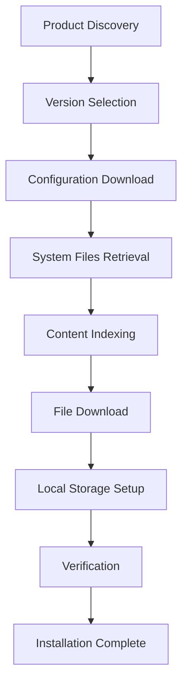

# Installation Process

## Overview

The NGDP installation process orchestrates the download and setup of game files from Blizzard's CDN infrastructure. This document details the complete workflow from initial discovery to playable installation.

## Installation Phases



## Phase 1: Product Discovery

### Query Available Products

```python
def discover_products():
    # Connect to Ribbit
    ribbit = RibbitClient("us.version.battle.net", 1119)
    
    # Get product summary
    summary = ribbit.query("v1/summary")
    
    # Parse available products
    products = []
    for row in summary:
        products.append({
            'code': row['Product'],
            'seqn': row['Seqn'],
            'flags': row['Flags']
        })
    
    return products
```

### Product Codes

Common products:
- `wow` - World of Warcraft Retail
- `wow_classic` - WoW Classic
- `wowt` - WoW Public Test Realm
- `wow_beta` - WoW Beta

## Phase 2: Version Selection

### Get Product Versions

```python
def get_product_versions(product_code):
    ribbit = RibbitClient()
    
    # Query versions
    versions = ribbit.query(f"v1/products/{product_code}/versions")
    
    # Parse version data
    builds = []
    for row in versions:
        builds.append({
            'region': row['Region'],
            'build_config': row['BuildConfig'],
            'cdn_config': row['CDNConfig'],
            'build_id': row['BuildId'],
            'version': row['VersionsName']
        })
    
    return builds
```

### Select Build

```python
def select_build(versions, criteria):
    # Filter by criteria
    if criteria.region:
        versions = [v for v in versions if v['region'] == criteria.region]
    
    if criteria.version:
        versions = [v for v in versions if v['version'] == criteria.version]
    
    # Select latest if multiple matches
    return max(versions, key=lambda v: v['build_id'])
```

## Phase 3: Configuration Download

### Get CDN Servers

```python
def get_cdn_servers(product_code):
    ribbit = RibbitClient()
    
    # Query CDN configurations
    cdns = ribbit.query(f"v1/products/{product_code}/cdns")
    
    servers = []
    for row in cdns:
        servers.append({
            'name': row['Name'],
            'path': row['Path'],
            'hosts': row['Hosts'].split(),
            'servers': row['Servers'].split(),
            'config_path': row['ConfigPath']
        })
    
    return servers
```

### Download Build Configuration

```python
def download_build_config(cdn, build_config_hash):
    # Construct URL
    url = f"{cdn.base_url}/config/{build_config_hash[0:2]}/{build_config_hash[2:4]}/{build_config_hash}"
    
    # Download and parse
    content = cdn.download(url)
    
    config = {}
    for line in content.split('\n'):
        if ' = ' in line:
            key, value = line.split(' = ', 1)
            config[key] = value
    
    return config
```

### Download CDN Configuration

```python
def download_cdn_config(cdn, cdn_config_hash):
    url = f"{cdn.base_url}/config/{cdn_config_hash[0:2]}/{cdn_config_hash[2:4]}/{cdn_config_hash}"
    
    content = cdn.download(url)
    
    config = {
        'archives': [],
        'archive_groups': [],
        'patch_archives': []
    }
    
    for line in content.split('\n'):
        if line.startswith('archives = '):
            config['archives'] = line.split(' = ')[1].split()
        elif line.startswith('archive-group = '):
            config['archive_groups'] = line.split(' = ')[1].split()
    
    return config
```

## Phase 4: System Files Retrieval

### Download Encoding File

```python
def download_encoding_file(cdn, build_config):
    encoding_hash = build_config['encoding'].split()[0]
    encoding_size = int(build_config['encoding'].split()[1])
    
    # Download from CDN
    url = construct_cdn_url(cdn, encoding_hash, 'data')
    content = cdn.download(url)
    
    # Decompress if needed
    if is_blte_encoded(content):
        content = blte_decode(content)
    
    # Parse encoding file
    encoding = EncodingFile(content)
    return encoding
```

### Download Root File

```python
def download_root_file(cdn, build_config, encoding):
    root_hash = build_config['root']
    
    # Get encoding key from encoding file
    ekey = encoding.get_encoding_key(root_hash)
    
    # Download from CDN
    url = construct_cdn_url(cdn, ekey, 'data')
    content = cdn.download(url)
    
    # Decode and parse
    content = blte_decode(content)
    root = RootFile(content)
    
    return root
```

### Download Install File

```python
def download_install_file(cdn, build_config, encoding):
    install_hash = build_config['install'].split()[0]
    
    # Get encoding key
    ekey = encoding.get_encoding_key(install_hash)
    
    # Download and decode
    content = cdn.download_and_decode(ekey)
    
    # Parse install file
    install = InstallFile(content)
    return install
```

## Phase 5: Content Indexing

### Build File Manifest

```python
def build_file_manifest(root, install, encoding):
    manifest = {}
    
    # Add files from install file (required files)
    for entry in install.entries:
        file_path = entry.path
        content_key = entry.content_hash
        encoding_key = encoding.get_encoding_key(content_key)
        
        manifest[file_path] = {
            'path': file_path,
            'ckey': content_key,
            'ekey': encoding_key,
            'size': entry.size,
            'priority': 'required'
        }
    
    # Add additional files from root
    for entry in root.entries:
        if entry.file_data_id not in manifest:
            ekey = encoding.get_encoding_key(entry.content_hash)
            manifest[entry.file_data_id] = {
                'file_id': entry.file_data_id,
                'ckey': entry.content_hash,
                'ekey': ekey,
                'flags': entry.flags
            }
    
    return manifest
```

### Download Archive Indices

```python
def download_archive_indices(cdn, cdn_config):
    indices = {}
    
    for archive_hash in cdn_config['archives']:
        # Download index file
        index_url = f"{cdn.base_url}/data/{archive_hash}.index"
        index_content = cdn.download(index_url)
        
        # Parse index
        index = ArchiveIndex(index_content)
        indices[archive_hash] = index
    
    return indices
```

## Phase 6: File Download

### Priority-Based Download

```python
class InstallationDownloader:
    def __init__(self, cdn, manifest, indices):
        self.cdn = cdn
        self.manifest = manifest
        self.indices = indices
        self.progress = ProgressTracker()
    
    async def download_all(self):
        # Sort files by priority
        required_files = [f for f in self.manifest.values() if f.get('priority') == 'required']
        optional_files = [f for f in self.manifest.values() if f.get('priority') != 'required']
        
        # Download required files first
        await self.download_batch(required_files, "Required Files")
        
        # Then optional files
        await self.download_batch(optional_files, "Optional Files")
    
    async def download_batch(self, files, description):
        tasks = []
        semaphore = asyncio.Semaphore(5)  # Limit concurrent downloads
        
        for file in files:
            task = self.download_file_with_limit(file, semaphore)
            tasks.append(task)
        
        await asyncio.gather(*tasks)
```

### Individual File Download

```python
async def download_file(self, file_info):
    ekey = file_info['ekey']
    
    # Check if in archive or loose file
    archive_info = self.find_in_archives(ekey)
    
    if archive_info:
        # Download from archive
        content = await self.download_from_archive(
            archive_info['archive'],
            archive_info['offset'],
            archive_info['size']
        )
    else:
        # Download as loose file
        url = construct_cdn_url(self.cdn, ekey, 'data')
        content = await self.cdn.download(url)
    
    # Decode BLTE
    content = blte_decode(content)
    
    # Verify integrity
    actual_hash = md5(content)
    if actual_hash != file_info['ckey']:
        raise IntegrityError(f"Hash mismatch for {file_info['path']}")
    
    return content
```

## Phase 7: Local Storage Setup

### Directory Structure Creation

```python
def setup_game_directory(install_path):
    directories = [
        'Data',
        'Data/data',
        'Data/indices',
        'Data/config',
        'Cache',
        'Logs',
        'Interface',
        'WTF'
    ]
    
    for dir in directories:
        path = os.path.join(install_path, dir)
        os.makedirs(path, exist_ok=True)
```

### File Installation

```python
def install_file(content, file_info, install_path):
    # Determine installation path
    if 'path' in file_info:
        file_path = os.path.join(install_path, file_info['path'])
    else:
        # Use CASC storage
        file_path = get_casc_path(file_info['ekey'])
    
    # Create directory if needed
    os.makedirs(os.path.dirname(file_path), exist_ok=True)
    
    # Write file atomically
    temp_path = f"{file_path}.tmp"
    with open(temp_path, 'wb') as f:
        f.write(content)
    
    # Set permissions
    if is_executable(file_info):
        os.chmod(temp_path, 0o755)
    
    # Move to final location
    os.rename(temp_path, file_path)
```

### Index Generation

```python
def generate_local_indices(manifest, install_path):
    # Create index buckets
    indices = [[] for _ in range(16)]
    
    for file_info in manifest.values():
        ekey = file_info['ekey']
        bucket = get_bucket_index(ekey)
        
        indices[bucket].append({
            'ekey': ekey,
            'offset': file_info.get('local_offset'),
            'size': file_info['size']
        })
    
    # Write index files
    for bucket, entries in enumerate(indices):
        index_path = f"{install_path}/Data/indices/{bucket:02x}.index"
        write_index_file(index_path, entries)
```

## Phase 8: Verification

### Integrity Check

```python
def verify_installation(manifest, install_path):
    errors = []
    verified = 0
    
    for file_info in manifest.values():
        file_path = get_file_path(file_info, install_path)
        
        if not os.path.exists(file_path):
            errors.append(f"Missing: {file_path}")
            continue
        
        # Verify checksum
        with open(file_path, 'rb') as f:
            content = f.read()
            actual_hash = md5(content)
        
        if actual_hash != file_info['ckey']:
            errors.append(f"Corrupt: {file_path}")
        else:
            verified += 1
    
    return {
        'verified': verified,
        'errors': errors,
        'total': len(manifest)
    }
```

### Repair Process

```python
def repair_installation(errors, manifest, cdn):
    repaired = []
    
    for error in errors:
        if error.startswith("Missing:") or error.startswith("Corrupt:"):
            file_path = error.split(": ")[1]
            file_info = find_file_info(manifest, file_path)
            
            # Re-download file
            content = download_file(cdn, file_info)
            install_file(content, file_info, install_path)
            
            repaired.append(file_path)
    
    return repaired
```

## Installation Options

### Minimal Installation

Downloads only required files for basic functionality:

```python
def minimal_install(manifest):
    return [f for f in manifest.values() if f.get('priority') == 'required']
```

### Full Installation

Downloads all available content:

```python
def full_install(manifest):
    return list(manifest.values())
```

### Language-Specific Installation

Filters files by locale:

```python
def language_specific_install(manifest, locale='enUS'):
    files = []
    locale_flag = get_locale_flag(locale)
    
    for file in manifest.values():
        if file.get('locale_flags', 0) & locale_flag:
            files.append(file)
    
    return files
```

## Progress Tracking

### Download Progress

```python
class ProgressTracker:
    def __init__(self, total_files, total_bytes):
        self.total_files = total_files
        self.total_bytes = total_bytes
        self.downloaded_files = 0
        self.downloaded_bytes = 0
        self.current_file = None
        self.start_time = time.time()
    
    def update(self, file_name, bytes_downloaded):
        self.current_file = file_name
        self.downloaded_bytes += bytes_downloaded
        
    def file_complete(self):
        self.downloaded_files += 1
        
    def get_progress(self):
        elapsed = time.time() - self.start_time
        bytes_per_second = self.downloaded_bytes / max(elapsed, 1)
        
        return {
            'files': f"{self.downloaded_files}/{self.total_files}",
            'bytes': f"{self.downloaded_bytes}/{self.total_bytes}",
            'percentage': (self.downloaded_bytes / self.total_bytes) * 100,
            'speed': bytes_per_second,
            'eta': (self.total_bytes - self.downloaded_bytes) / bytes_per_second if bytes_per_second > 0 else 0
        }
```

## Error Recovery

### Resume Interrupted Installation

```python
def resume_installation(manifest, install_path):
    # Check what's already downloaded
    completed = []
    remaining = []
    
    for file_info in manifest.values():
        file_path = get_file_path(file_info, install_path)
        
        if os.path.exists(file_path):
            # Verify existing file
            if verify_file(file_path, file_info['ckey']):
                completed.append(file_info)
            else:
                # Corrupted, re-download
                remaining.append(file_info)
        else:
            remaining.append(file_info)
    
    return completed, remaining
```

## Platform-Specific Considerations

### Windows

```python
def windows_specific_setup():
    # Create shortcuts
    create_desktop_shortcut()
    
    # Register with Windows
    register_uninstaller()
    
    # Set file associations
    register_file_associations('.replay', 'WoW Replay')
```

### macOS

```python
def macos_specific_setup():
    # Create app bundle
    create_app_bundle()
    
    # Set permissions
    set_quarantine_flags()
    
    # Register with LaunchServices
    register_with_launch_services()
```

### Linux

```python
def linux_specific_setup():
    # Create desktop entry
    create_desktop_entry()
    
    # Set executable permissions
    set_executable_permissions()
    
    # Update icon cache
    update_icon_cache()
```

## Post-Installation

### Configuration Files

```python
def create_default_config(install_path):
    config = {
        'version': get_installed_version(),
        'install_path': install_path,
        'locale': 'enUS',
        'architecture': platform.machine()
    }
    
    config_path = os.path.join(install_path, 'config.json')
    with open(config_path, 'w') as f:
        json.dump(config, f, indent=2)
```

### First Launch Preparation

```python
def prepare_first_launch():
    # Generate machine-specific files
    generate_machine_id()
    
    # Create user directories
    create_user_directories()
    
    # Initialize settings
    create_default_settings()
    
    # Verify DirectX/OpenGL support
    check_graphics_requirements()
```