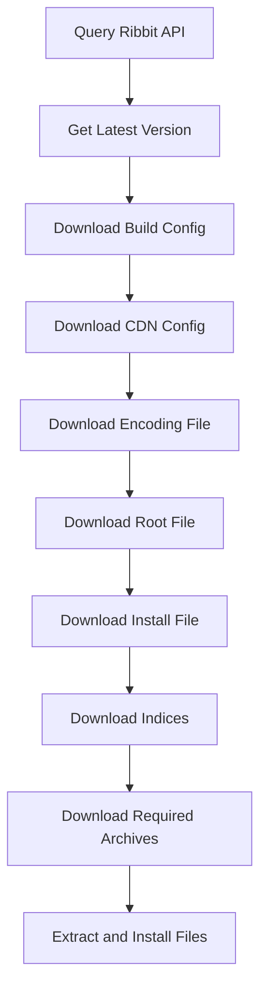
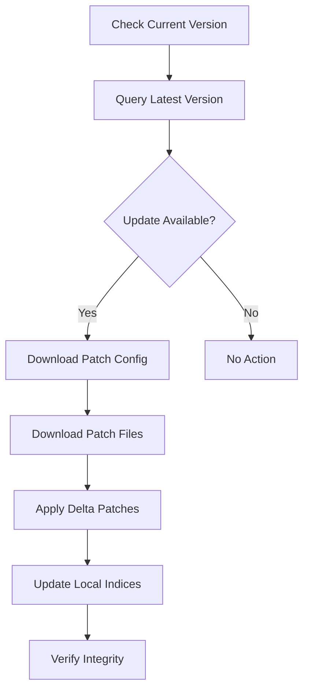

# NGDP Architecture Overview

## Executive Summary

NGDP (Next Generation Distribution Pipeline) is Blizzard Entertainment's modern content distribution system that replaced the older MPQ archive format. This document provides a comprehensive technical overview of NGDP's architecture, components, and workflow based on analysis of multiple reference implementations.

## System Components

### Core Technologies

1. **Ribbit Protocol** - API communication layer for product metadata
2. **TACT** - Transfer And Content Transfer protocol for file distribution
3. **CASC** - Content Addressable Storage Container for local storage
4. **TVFS** - TACT Virtual File System for game client integration
5. **CDN Infrastructure** - Global content delivery network

## Ribbit Protocol

### Overview

Ribbit is Blizzard's proprietary protocol for querying product information, versions, and CDN configurations. It operates over TCP on port 1119.

### Connection Details

```
Endpoint: {region}.version.battle.net:1119
Regions: us, eu, kr, tw, cn
Protocol: TCP with MIME-formatted responses
```

### API Commands

| Command | Purpose |
|---------|---------|
| `v1/summary` | List all available products |
| `v1/products/{product}/versions` | Get version information for a product |
| `v1/products/{product}/cdns` | Get CDN server configurations |
| `v1/products/{product}/bgdl` | Background download information |

### Response Format

Responses follow a MIME-like format with headers and data sections:

```
## seqn = 123456
Region!STRING:0|BuildConfig!HEX:16|CDNConfig!HEX:16|KeyRing!HEX:16|BuildId!DEC:4|VersionsName!String:0|ProductConfig!HEX:16
us|abc123...|def456...|789012...|12345|1.14.4.52237|345678...
eu|abc123...|def456...|789012...|12345|1.14.4.52237|345678...
```

### Data Structures

#### Version Definition
- Build configuration hash
- CDN configuration hash
- Build ID
- Version name
- Product configuration hash
- KeyRing (encryption keys)

#### CDN Definition
- CDN hostnames
- Path prefixes
- Configuration hashes
- Regional variations

## TACT Protocol

### Content Addressing

TACT uses a multi-layered content addressing scheme:

1. **File Data ID** - Numeric identifier for game files
2. **Content Key (CKey)** - MD5 hash of uncompressed file content
3. **Encoding Key (EKey)** - MD5 hash of encoded/compressed content

### System Files

#### Build Configuration
Contains references to all system files and their properties:
- Root file hash and size
- Encoding file hash and size
- Install file hash and size
- Download file hash and size
- Patch file hash and size

#### CDN Configuration
Defines archive structure and CDN settings:
- Archive group configurations
- File index mappings
- Patch archive information

#### Encoding File
Maps content keys to encoding keys with compression information:
```
Structure:
- Header with version and hash counts
- CKey to EKey mappings
- File sizes (compressed and uncompressed)
- Encoding specifications
```

#### Root File
Maps File Data IDs to content keys with metadata:
```
Structure:
- Header with locale and content flags
- File Data ID to CKey mappings
- Named file lookups (Jenkins hash)
- Locale-specific content flags
```

#### Install File
Lists files required for game installation:
- Critical game files
- Installation order
- File priorities
- Size information

#### Download File
Contains files for patches and updates:
- Update-specific files
- Delta patches
- Priority information

### BLTE Encoding

BLTE (Block Table Encoded) is TACT's compression format:

```
Structure:
- Magic: 'BLTE'
- Header size
- Flags and chunk count
- Chunk information (compressed size, decompressed size, checksum)
- Compressed data blocks
```

Compression modes:
- None (N)
- Zlib (Z)
- Encrypted (E)
- Frame (F)

## CASC Storage

### Directory Structure

```
/Data/
├── indices/
│   ├── {hash}.index     # Group indices
│   └── {fileindex}.idx   # File indices
├── data/
│   ├── data.{000-999}   # Archive files
│   └── patch.{000-999}  # Patch archives
├── config/
│   └── {hash}/          # Configuration cache
└── raw/
    └── {hash}           # Loose files
```

### Index System

#### Group Indices
Map encoding keys to archive locations:
```
Structure:
- Header with bucket count
- Hash table buckets
- EKey to archive+offset mappings
```

#### File Indices
Alternative indexing for specific files:
```
Structure:
- Version information
- Direct file mappings
- Offset tables
```

### Archive Format

Archives contain multiple BLTE-encoded files:
```
Structure:
- Header with file count
- File entries (hash, size, offset)
- BLTE-encoded file data
```

## CDN Infrastructure

### CDN Organization

```
http://{hostname}/{path}/
├── config/
│   ├── {hex:2}/{hex:2}/{hash}      # Configuration files
│   └── {hex:2}/{hex:2}/{hash}.BLTE # Encoded configs
├── data/
│   ├── {hex:2}/{hex:2}/{hash}      # Data files
│   ├── {hex:2}/{hex:2}/{hash}.BLTE # Encoded data
│   └── {hash}.index                 # Index files
└── patch/
    └── {hex:2}/{hex:2}/{hash}      # Patch files
```

### Path Patterns

Files are stored using hash-based paths for distribution:
- First 2 hex characters: First directory level
- Next 2 hex characters: Second directory level
- Remaining hash: Filename

Example: Hash `abc123def456...` → `/ab/c1/abc123def456...`

### CDN Selection

1. Query Ribbit for CDN list
2. Select CDN based on region and availability
3. Implement fallback to secondary CDNs
4. Load balance across multiple CDN servers

## Installation Workflow

### Initial Installation



### Detailed Steps

1. **Product Discovery**
   - Connect to Ribbit server
   - Query product versions
   - Select appropriate build

2. **Configuration Download**
   - Fetch build configuration
   - Fetch CDN configuration
   - Parse configuration files

3. **System File Retrieval**
   - Download encoding file
   - Download root file
   - Download install file
   - Cache system files

4. **Content Download**
   - Parse install file for required files
   - Map File Data IDs to CKeys
   - Map CKeys to EKeys
   - Download from CDN

5. **File Installation**
   - Decode BLTE files
   - Verify checksums
   - Place files in game directory
   - Update local indices

## Update Process

### Patch Workflow



### Update Types

1. **Full Update**
   - Download complete new files
   - Replace existing files
   - Update all indices

2. **Delta Patch**
   - Download patch files
   - Apply binary diffs
   - Update modified files only

3. **Background Download**
   - Pre-download future content
   - Stage updates without applying
   - Apply on next game launch

## Content Addressing

### Hash Types and Usage

| Hash Type | Usage | Format |
|-----------|-------|--------|
| MD5 | Content Keys (CKey) | 16 bytes hex |
| MD5 | Encoding Keys (EKey) | 16 bytes hex |
| SHA-256 | Ribbit checksums | 32 bytes hex |
| Jenkins/Lookup3 | Filename hashing | 8 bytes |

### Content Deduplication

- Identical files share same CKey
- Different encodings have unique EKeys
- Archives eliminate duplicate storage
- Hardlinks for local deduplication

## Security and Integrity

### Signature Verification

1. **Ribbit Responses**
   - X.509 certificate signatures
   - Certificate chain validation
   - OCSP verification

2. **Content Verification**
   - MD5 checksums for all files
   - BLTE chunk checksums
   - Encoding file validation

### Encryption

- Some content encrypted with game-specific keys
- KeyRing provides decryption keys
- BLTE 'E' flag indicates encryption

## Error Handling

### Retry Strategies

1. **Network Failures**
   - Exponential backoff
   - CDN fallback
   - Resume partial downloads

2. **Integrity Failures**
   - Re-download corrupted files
   - Verify against multiple checksums
   - Report persistent failures

### Recovery Mechanisms

- Partial file recovery
- Index rebuilding
- Configuration cache refresh
- Repair installation option

## Performance Optimizations

### Parallel Downloads

- Multiple concurrent connections
- Chunked transfer for large files
- Pipeline small file requests

### Caching Strategies

1. **Local Caching**
   - System file cache
   - Index cache
   - Configuration cache

2. **Memory Caching**
   - Hot file retention
   - Index memory maps
   - Decompression cache

### Bandwidth Management

- Throttling support
- Background download scheduling
- Peer-to-peer sharing (optional)

## Implementation Considerations

### Platform Differences

| Platform | Considerations |
|----------|---------------|
| Windows | NTFS features, case-insensitive paths |
| macOS | HFS+/APFS, case-sensitive option |
| Linux | Various filesystems, always case-sensitive |

### Storage Requirements

- Base installation: Varies by game (5-100GB)
- Index overhead: ~1-2% of game size
- Cache requirements: 500MB-2GB
- Temporary space: 2x largest file

### Network Requirements

- Minimum bandwidth: 1 Mbps
- Recommended: 10+ Mbps
- Latency tolerance: <500ms
- Connection stability: Important

## Glossary

| Term | Definition |
|------|------------|
| NGDP | Next Generation Distribution Pipeline |
| TACT | Transfer And Content Transfer |
| CASC | Content Addressable Storage Container |
| TVFS | TACT Virtual File System |
| CKey | Content Key - Hash of file content |
| EKey | Encoding Key - Hash of encoded content |
| BLTE | Block Table Encoded compression |
| BPSV | Binary Protocol Sequence Variable format |

## References

- [WoWDev Wiki - NGDP](https://wowdev.wiki/NGDP)
- [WoWDev Wiki - TACT](https://wowdev.wiki/TACT)
- [WoWDev Wiki - CASC](https://wowdev.wiki/CASC)
- [Wago Tools API](https://wago.tools/apis)