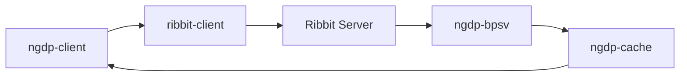
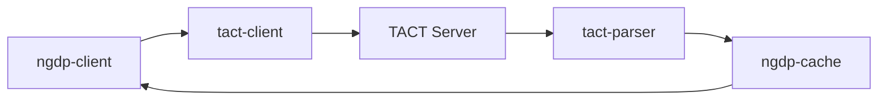
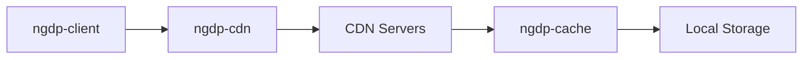

# Cascette-RS Project Implementation Map

## Overview

This document maps how each crate in the cascette-rs project implements specific parts of the NGDP/TACT/CASC technology stack.

## Architecture Layers

```
┌─────────────────────────────────────────────────────────┐
│                   ngdp-client (CLI)                      │
├─────────────────────────────────────────────────────────┤
│                    ngdp-cache                            │
│              (Caching Layer for All)                     │
├──────────────┬────────────────┬─────────────────────────┤
│ribbit-client │  tact-client   │      ngdp-cdn           │
│  (Ribbit)    │     (TACT)     │   (CDN Downloads)       │
├──────────────┴────────────────┴─────────────────────────┤
│           ngdp-bpsv           │      tact-parser         │
│       (Data Format)           │   (Binary Formats)       │
└───────────────────────────────┴─────────────────────────┘
```

## Crate-to-Technology Mapping

### Foundation Layer

#### ngdp-bpsv
- **Implements**: BPSV (Binary Protocol Sequence Variable) format
- **NGDP Component**: Data serialization format
- **Key Features**:
  - Zero-copy parsing for performance
  - Schema validation
  - Builder pattern for document creation
  - Type-safe value handling

#### tact-parser
- **Implements**: TACT binary format parsing
- **NGDP Component**: File format interpretation
- **Key Features**:
  - WoW root file parsing (TSFM/MFST)
  - Jenkins3 hash implementation
  - Support for multiple format versions
  - Efficient I/O for large files

### Protocol Layer

#### ribbit-client
- **Implements**: Ribbit protocol
- **NGDP Component**: Service discovery and metadata
- **API Endpoints**:
  ```
  v1/summary              → Product listing
  v1/products/{}/versions → Version information
  v1/products/{}/cdns     → CDN configurations
  v1/products/{}/bgdl     → Background download info
  v1/certs/{}            → Certificate retrieval
  ```
- **Key Features**:
  - Async TCP client
  - Signature verification
  - DNS caching
  - Retry logic with backoff

#### tact-client
- **Implements**: TACT HTTP protocol
- **NGDP Component**: Configuration retrieval
- **Protocols**:
  - V1: TCP port 1119
  - V2: HTTPS REST API
- **Key Features**:
  - Multi-protocol support
  - Regional endpoint management
  - Retry mechanisms

#### ngdp-cdn
- **Implements**: CDN content delivery
- **NGDP Component**: File download
- **CDN Structure**:
  ```
  /config/{hash[0:2]}/{hash[2:4]}/{hash}  → Configuration files
  /data/{hash[0:2]}/{hash[2:4]}/{hash}    → Content files
  /patch/{hash[0:2]}/{hash[2:4]}/{hash}   → Patch files
  ```
- **Key Features**:
  - Connection pooling
  - Fallback CDN support
  - Compression handling
  - Parallel downloads

### Optimization Layer

#### ngdp-cache
- **Implements**: Caching for all protocols
- **NGDP Component**: Performance optimization
- **Cached Components**:
  - Ribbit responses
  - TACT configurations
  - CDN content
  - Generic data
- **Cache Structure**:
  ```
  cache/
  ├── ribbit/           # Ribbit protocol responses
  ├── tact/            # TACT configurations
  ├── cdn/             # CDN content
  │   ├── config/      # Configuration files
  │   ├── data/        # Game data files
  │   └── patch/       # Patch files
  └── generic/         # Other cached data
  ```

### Application Layer

#### ngdp-client
- **Implements**: Command-line interface
- **NGDP Component**: User interaction
- **Commands**:
  ```
  products list        → List all products
  products versions    → Get product versions
  products cdns        → Get CDN configurations
  products builds      → Query build history (via Wago)
  storage init        → Initialize local storage
  storage verify      → Verify integrity
  download config     → Download configurations
  download data       → Download game data
  inspect             → Inspect local files
  ```

## Technology Implementation Status

### Fully Implemented

| Technology | Crate | Status |
|------------|-------|--------|
| Ribbit Protocol V1/V2 | ribbit-client | ✅ Complete |
| BPSV Format | ngdp-bpsv | ✅ Complete |
| TACT HTTP Client | tact-client | ✅ Complete |
| CDN Downloads | ngdp-cdn | ✅ Complete |
| Caching Layer | ngdp-cache | ✅ Complete |
| CLI Interface | ngdp-client | ✅ Complete |
| WoW Root Files | tact-parser | ✅ Complete |

### Partially Implemented

| Technology | Crate | Status | Missing |
|------------|-------|--------|---------|
| TACT System Files | tact-parser | 🚧 Partial | Encoding, Install, Download files |
| BLTE Compression | - | 🚧 Planned | Decompression algorithm |

### Not Yet Implemented

| Technology | Planned Crate | Target Version |
|------------|---------------|----------------|
| CASC Storage | casc-storage | v0.2.0 |
| TVFS | tvfs | v0.2.0 |
| BLTE Encoding | blte | v0.2.0 |
| Patch Application | patch-manager | v0.3.0 |

## Data Flow Through Crates

### Product Discovery Flow



### Configuration Download Flow



### Content Download Flow



## Integration Points

### External APIs

1. **Blizzard Ribbit API**
   - Endpoint: `{region}.version.battle.net:1119`
   - Implemented by: `ribbit-client`

2. **Blizzard CDN**
   - Various CDN hosts (level3, edgecast, etc.)
   - Implemented by: `ngdp-cdn`

3. **Wago Tools API**
   - Endpoint: `https://wago.tools/api/`
   - Used by: `ngdp-client` (products builds command)

### Inter-Crate Dependencies

```
ngdp-client
├── ribbit-client
│   └── ngdp-bpsv
├── tact-client
│   └── ngdp-bpsv
├── tact-parser
├── ngdp-cdn
└── ngdp-cache
    ├── ribbit-client
    ├── tact-client
    └── ngdp-cdn
```

## File Format Support

### Currently Supported

| Format | Crate | Read | Write |
|--------|-------|------|-------|
| BPSV | ngdp-bpsv | ✅ | ✅ |
| WoW Root (TSFM) | tact-parser | ✅ | ❌ |
| WoW Root (MFST) | tact-parser | ✅ | ❌ |
| JSON | ngdp-client | ✅ | ✅ |

### Planned Support

| Format | Target Crate | Version |
|--------|-------------|---------|
| BLTE | blte | v0.2.0 |
| Encoding File | tact-parser | v0.2.0 |
| Install File | tact-parser | v0.2.0 |
| Download File | tact-parser | v0.2.0 |
| CASC Index | casc-storage | v0.2.0 |
| CASC Archive | casc-storage | v0.2.0 |

## Performance Characteristics

### ngdp-bpsv
- Zero-copy parsing reduces memory allocations
- Lazy value conversion for efficiency
- Suitable for large BPSV documents

### ribbit-client
- DNS caching reduces lookup overhead
- Connection reuse for multiple requests
- Exponential backoff prevents server overload

### ngdp-cdn
- Connection pooling for parallel downloads
- Configurable concurrency limits
- Stream-based downloads for large files

### ngdp-cache
- File-based caching with TTL support
- CDN path structure preservation
- Atomic write operations for consistency

## Security Implementation

### Signature Verification (ribbit-client)
- X.509 certificate validation
- CMS (Cryptographic Message Syntax) parsing
- SHA-256 checksum verification

### Content Integrity
- MD5 checksums for content validation
- Future: BLTE chunk-level checksums

### Encryption Support
- Future: Salsa20 decryption for protected content
- KeyRing support planned

## Testing Coverage

| Crate | Unit Tests | Integration Tests | Coverage |
|-------|------------|------------------|----------|
| ngdp-bpsv | ✅ | ✅ | ~85% |
| ribbit-client | ✅ | ✅ | ~80% |
| tact-client | ✅ | ✅ | ~75% |
| tact-parser | ✅ | ✅ | ~80% |
| ngdp-cdn | ✅ | ✅ | ~75% |
| ngdp-cache | ✅ | ✅ | ~80% |
| ngdp-client | ✅ | ❌ | ~60% |

## Future Development Roadmap

### Version 0.2.0 (Q1 2025)
- [ ] BLTE compression/decompression
- [ ] Complete TACT file parsing
- [ ] CASC storage implementation
- [ ] Basic TVFS support

### Version 0.3.0 (Q2 2025)
- [ ] Patch application
- [ ] Delta updates
- [ ] Peer-to-peer support
- [ ] Advanced TVFS features

### Version 1.0.0 (Q3 2025)
- [ ] Full feature parity with Blizzard client
- [ ] Production-ready stability
- [ ] Complete documentation
- [ ] Performance optimizations