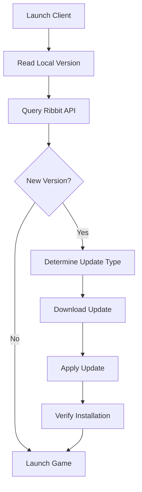

# Update Process

## Overview

The NGDP update process manages incremental updates to installed games, using delta patching, background downloads, and intelligent file management to minimize download size and update time.

## Update Detection

### Version Check Flow



### Local Version Detection

```python
def get_local_version(install_path):
    # Check build info file
    build_info_path = os.path.join(install_path, '.build.info')
    
    if os.path.exists(build_info_path):
        with open(build_info_path, 'r') as f:
            for line in f:
                if line.startswith('Version'):
                    return line.split('|')[1].strip()
    
    # Fallback to config
    config_path = os.path.join(install_path, 'config.json')
    if os.path.exists(config_path):
        with open(config_path, 'r') as f:
            config = json.load(f)
            return config.get('version')
    
    return None
```

### Remote Version Query

```python
async def check_for_updates(product, current_version):
    # Query latest version
    ribbit = RibbitClient()
    versions = await ribbit.get_product_versions(product)
    
    # Find latest for region
    latest = max(versions, key=lambda v: v['BuildId'])
    
    # Compare versions
    if version_compare(latest['VersionsName'], current_version) > 0:
        return {
            'available': True,
            'current': current_version,
            'latest': latest['VersionsName'],
            'build_id': latest['BuildId'],
            'build_config': latest['BuildConfig'],
            'cdn_config': latest['CDNConfig']
        }
    
    return {'available': False}
```

## Update Types

### 1. Full Update

Complete file replacement for major updates:

```python
def full_update(old_version, new_version):
    # Download new build config
    new_config = download_build_config(new_version['build_config'])
    
    # Get new file manifest
    new_manifest = build_manifest(new_config)
    
    # Download all changed files
    for file in new_manifest:
        download_and_install(file)
```

### 2. Delta Patch

Incremental updates using binary diffs:

```python
def delta_patch_update(old_version, new_version):
    # Download patch config
    patch_config = download_patch_config(old_version, new_version)
    
    # Get patch files
    patches = patch_config['patches']
    
    for patch in patches:
        # Download patch file
        patch_data = download_patch(patch['hash'])
        
        # Apply to existing file
        apply_patch(
            source=patch['source_file'],
            patch=patch_data,
            target=patch['target_file']
        )
```

### 3. Hybrid Update

Combination of patches and full downloads:

```python
def hybrid_update(old_manifest, new_manifest):
    updates = []
    
    for file_id, new_info in new_manifest.items():
        old_info = old_manifest.get(file_id)
        
        if not old_info:
            # New file - full download
            updates.append({
                'type': 'download',
                'file': new_info
            })
        elif old_info['ckey'] != new_info['ckey']:
            # Changed file - check for patch
            patch = find_patch(old_info['ckey'], new_info['ckey'])
            
            if patch and patch['size'] < new_info['size'] * 0.5:
                # Patch is smaller than 50% of full file
                updates.append({
                    'type': 'patch',
                    'patch': patch,
                    'target': new_info
                })
            else:
                # Full download more efficient
                updates.append({
                    'type': 'download',
                    'file': new_info
                })
    
    return updates
```

## Patch System

### ZBSDIFF Format

NGDP uses ZBSDIFF for binary patching:

```python
class ZBSDIFFPatch:
    """
    ZBSDIFF1 format:
    - Magic: 'ZBSDIFF1'
    - Control block length
    - Diff block length  
    - New file length
    - Control block (compressed)
    - Diff block (compressed)
    - Extra block (compressed)
    """
    
    def __init__(self, patch_data):
        self.parse_header(patch_data)
        self.control = decompress(self.control_data)
        self.diff = decompress(self.diff_data)
        self.extra = decompress(self.extra_data)
    
    def apply(self, source_data):
        result = bytearray()
        source_pos = 0
        
        for ctrl in self.control:
            # Add diff bytes
            for i in range(ctrl.diff_size):
                result.append(source_data[source_pos + i] + self.diff[i])
            source_pos += ctrl.diff_size
            
            # Add extra bytes
            result.extend(self.extra[ctrl.extra_offset:ctrl.extra_offset + ctrl.extra_size])
            
            # Seek in source
            source_pos += ctrl.seek_offset
        
        return bytes(result)
```

### Patch Application

```python
def apply_patch_file(source_path, patch_path, target_path):
    # Read source file
    with open(source_path, 'rb') as f:
        source_data = f.read()
    
    # Read patch
    with open(patch_path, 'rb') as f:
        patch_data = f.read()
    
    # Decode if BLTE encoded
    if is_blte_encoded(patch_data):
        patch_data = blte_decode(patch_data)
    
    # Apply patch
    patch = ZBSDIFFPatch(patch_data)
    target_data = patch.apply(source_data)
    
    # Verify result
    expected_hash = get_expected_hash(target_path)
    actual_hash = md5(target_data)
    
    if actual_hash != expected_hash:
        raise PatchError(f"Patch verification failed for {target_path}")
    
    # Write result
    with open(target_path, 'wb') as f:
        f.write(target_data)
```

## Background Downloads

### Pre-Download System

```python
class BackgroundDownloader:
    def __init__(self, cdn_client):
        self.cdn = cdn_client
        self.queue = PriorityQueue()
        self.active = False
        self.bandwidth_limit = 1024 * 1024  # 1 MB/s
    
    async def start_background_download(self, manifest):
        self.active = True
        
        # Add files to queue with priority
        for file in manifest:
            priority = self.calculate_priority(file)
            self.queue.put((priority, file))
        
        # Start download task
        asyncio.create_task(self.download_worker())
    
    async def download_worker(self):
        while self.active and not self.queue.empty():
            priority, file = self.queue.get()
            
            # Throttle bandwidth
            await self.download_with_throttle(file)
            
            # Store in staging area
            self.store_staged(file)
```

### Staging Area

```python
def setup_staging_area(install_path):
    staging_path = os.path.join(install_path, '.staging')
    
    structure = {
        'pending': [],      # Files to download
        'downloaded': [],   # Ready to install
        'verified': [],     # Integrity checked
        'metadata': {
            'version': None,
            'timestamp': None,
            'size': 0
        }
    }
    
    os.makedirs(staging_path, exist_ok=True)
    
    with open(os.path.join(staging_path, 'manifest.json'), 'w') as f:
        json.dump(structure, f)
    
    return staging_path
```

## Update Installation

### Pre-Installation Checks

```python
def pre_update_checks(install_path, update_size):
    checks = {
        'disk_space': True,
        'permissions': True,
        'game_running': False,
        'files_locked': False
    }
    
    # Check disk space
    stat = os.statvfs(install_path)
    free_space = stat.f_bavail * stat.f_frsize
    checks['disk_space'] = free_space > update_size * 1.5
    
    # Check permissions
    test_file = os.path.join(install_path, '.write_test')
    try:
        with open(test_file, 'w') as f:
            f.write('test')
        os.remove(test_file)
    except:
        checks['permissions'] = False
    
    # Check if game running
    checks['game_running'] = is_process_running('Wow.exe')
    
    # Check file locks
    checks['files_locked'] = check_file_locks(install_path)
    
    return checks
```

### Atomic Update Process

```python
class AtomicUpdater:
    def __init__(self, install_path):
        self.install_path = install_path
        self.backup_path = f"{install_path}.backup"
        self.staging_path = f"{install_path}.staging"
    
    def update(self, update_files):
        try:
            # Create backup of files to be updated
            self.backup_files(update_files)
            
            # Apply updates
            for file in update_files:
                self.apply_file_update(file)
            
            # Verify update
            if not self.verify_update():
                raise UpdateError("Verification failed")
            
            # Commit changes
            self.commit_update()
            
        except Exception as e:
            # Rollback on error
            self.rollback()
            raise
        
        finally:
            # Cleanup
            self.cleanup()
    
    def backup_files(self, files):
        for file in files:
            source = os.path.join(self.install_path, file['path'])
            if os.path.exists(source):
                backup = os.path.join(self.backup_path, file['path'])
                os.makedirs(os.path.dirname(backup), exist_ok=True)
                shutil.copy2(source, backup)
    
    def rollback(self):
        if os.path.exists(self.backup_path):
            shutil.rmtree(self.install_path)
            shutil.move(self.backup_path, self.install_path)
```

## Update Verification

### File Integrity Check

```python
def verify_update(manifest, install_path):
    verification_results = {
        'success': [],
        'failed': [],
        'missing': []
    }
    
    for file_info in manifest:
        file_path = os.path.join(install_path, file_info['path'])
        
        if not os.path.exists(file_path):
            verification_results['missing'].append(file_path)
            continue
        
        # Verify checksum
        with open(file_path, 'rb') as f:
            content = f.read()
            actual_hash = md5(content)
        
        if actual_hash == file_info['ckey']:
            verification_results['success'].append(file_path)
        else:
            verification_results['failed'].append(file_path)
    
    return verification_results
```

### Version Validation

```python
def validate_version(install_path, expected_version):
    # Update version file
    version_file = os.path.join(install_path, '.version')
    
    with open(version_file, 'w') as f:
        f.write(expected_version)
    
    # Update build info
    update_build_info(install_path, expected_version)
    
    # Verify critical files
    critical_files = get_critical_files()
    for file in critical_files:
        if not os.path.exists(os.path.join(install_path, file)):
            return False
    
    return True
```

## Differential Updates

### Change Detection

```python
def detect_changes(old_manifest, new_manifest):
    changes = {
        'added': [],
        'removed': [],
        'modified': [],
        'unchanged': []
    }
    
    old_files = {f['path']: f for f in old_manifest}
    new_files = {f['path']: f for f in new_manifest}
    
    # Find added files
    for path in new_files:
        if path not in old_files:
            changes['added'].append(new_files[path])
    
    # Find removed files
    for path in old_files:
        if path not in new_files:
            changes['removed'].append(old_files[path])
    
    # Find modified files
    for path in new_files:
        if path in old_files:
            if old_files[path]['ckey'] != new_files[path]['ckey']:
                changes['modified'].append({
                    'old': old_files[path],
                    'new': new_files[path]
                })
            else:
                changes['unchanged'].append(new_files[path])
    
    return changes
```

### Optimized Download

```python
def optimize_download_list(changes, available_patches):
    download_list = []
    total_size = 0
    
    for change in changes['modified']:
        old_hash = change['old']['ckey']
        new_hash = change['new']['ckey']
        
        # Check for available patch
        patch = find_patch(old_hash, new_hash, available_patches)
        
        if patch:
            patch_size = patch['size']
            full_size = change['new']['size']
            
            # Use patch if significantly smaller
            if patch_size < full_size * 0.7:
                download_list.append({
                    'type': 'patch',
                    'url': patch['url'],
                    'size': patch_size
                })
                total_size += patch_size
                continue
        
        # Fall back to full download
        download_list.append({
            'type': 'full',
            'file': change['new'],
            'size': change['new']['size']
        })
        total_size += change['new']['size']
    
    # Add new files
    for file in changes['added']:
        download_list.append({
            'type': 'full',
            'file': file,
            'size': file['size']
        })
        total_size += file['size']
    
    return download_list, total_size
```

## Update Scheduling

### Smart Scheduling

```python
class UpdateScheduler:
    def __init__(self):
        self.schedule = []
        self.preferences = self.load_preferences()
    
    def schedule_update(self, update_info):
        # Check user preferences
        if self.preferences['auto_update']:
            if self.preferences['update_time'] == 'immediate':
                return self.schedule_immediate()
            elif self.preferences['update_time'] == 'off_peak':
                return self.schedule_off_peak()
            elif self.preferences['update_time'] == 'scheduled':
                return self.schedule_at_time(self.preferences['scheduled_time'])
        
        return None
    
    def schedule_off_peak(self):
        # Determine off-peak hours
        current_hour = datetime.now().hour
        
        if 2 <= current_hour <= 6:
            # Already off-peak
            return datetime.now()
        else:
            # Schedule for 2 AM
            tomorrow = datetime.now() + timedelta(days=1)
            return tomorrow.replace(hour=2, minute=0, second=0)
```

## Rollback Mechanism

### Rollback Support

```python
class RollbackManager:
    def __init__(self, install_path):
        self.install_path = install_path
        self.rollback_dir = os.path.join(install_path, '.rollback')
        self.max_rollbacks = 3
    
    def create_rollback_point(self, version):
        rollback_path = os.path.join(self.rollback_dir, version)
        
        # Store critical files
        critical_files = get_critical_files()
        for file in critical_files:
            source = os.path.join(self.install_path, file)
            if os.path.exists(source):
                dest = os.path.join(rollback_path, file)
                os.makedirs(os.path.dirname(dest), exist_ok=True)
                shutil.copy2(source, dest)
        
        # Store manifest
        manifest_path = os.path.join(rollback_path, 'manifest.json')
        with open(manifest_path, 'w') as f:
            json.dump({
                'version': version,
                'timestamp': time.time(),
                'files': critical_files
            }, f)
        
        # Cleanup old rollbacks
        self.cleanup_old_rollbacks()
    
    def rollback_to(self, version):
        rollback_path = os.path.join(self.rollback_dir, version)
        
        if not os.path.exists(rollback_path):
            raise RollbackError(f"No rollback point for version {version}")
        
        # Restore files
        manifest_path = os.path.join(rollback_path, 'manifest.json')
        with open(manifest_path, 'r') as f:
            manifest = json.load(f)
        
        for file in manifest['files']:
            source = os.path.join(rollback_path, file)
            dest = os.path.join(self.install_path, file)
            
            if os.path.exists(source):
                os.makedirs(os.path.dirname(dest), exist_ok=True)
                shutil.copy2(source, dest)
```

## Update Metrics

### Performance Tracking

```python
class UpdateMetrics:
    def __init__(self):
        self.metrics = {
            'start_time': None,
            'end_time': None,
            'files_updated': 0,
            'bytes_downloaded': 0,
            'patches_applied': 0,
            'errors': [],
            'retry_count': 0
        }
    
    def record_update(self):
        return {
            'duration': self.metrics['end_time'] - self.metrics['start_time'],
            'speed': self.metrics['bytes_downloaded'] / (self.metrics['end_time'] - self.metrics['start_time']),
            'efficiency': self.metrics['patches_applied'] / max(self.metrics['files_updated'], 1),
            'success_rate': 1 - (len(self.metrics['errors']) / max(self.metrics['files_updated'], 1))
        }
```