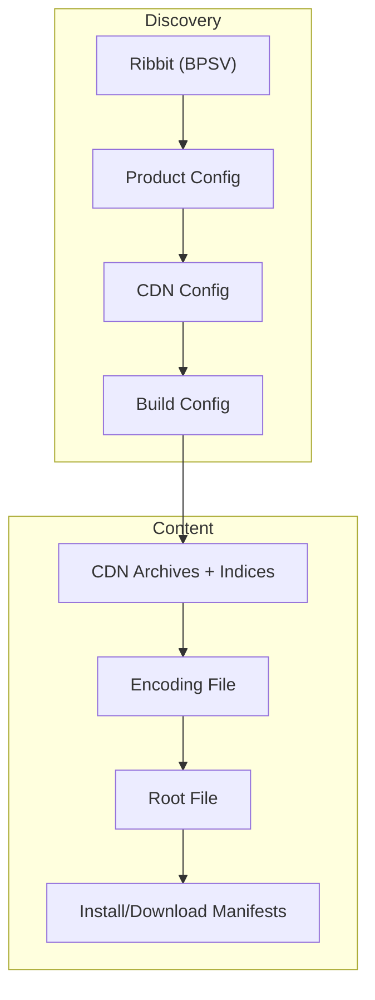

# cascette-rs Documentation

## About This Project

cascette-rs is part of the [wowemulation-dev](https://github.com/wowemulation-dev)
initiative to build open source tooling for World of Warcraft emulation. The
project focuses on modern WoW Classic clients (1.13+, 2.5+, 3.4+) which use
Blizzard's NGDP content distribution system.

### Why Modern Clients?

The WoW emulation and modding community has historically focused on the 3.3.5a
client from 2008. While functional, this approach has limitations:

- **Outdated technology**: MPQ archives, no content addressing, manual patching
- **Fragmented tooling**: Many tools exist only as abandoned Windows binaries
- **Limited modding**: Technical constraints restrict what can be modified

Modern Classic clients differ from 3.3.5a:

- **Active development**: Blizzard continues updating these clients
- **Better architecture**: NGDP/CASC enables content addressing and streaming
- **Cross-platform**: Same content format works on Windows, macOS, and Linux
- **Preservation**: Community CDN mirrors ensure historical builds remain available

## What You Can Do with cascette-rs

### For Emulator Developers

- Download specific WoW Classic builds for server development
- Extract game data files (DBCs, maps, models) for server-side use
- Verify client installations match expected versions
- Serve game content to clients via the Agent API

### For Archivists

- Mirror complete WoW builds from Blizzard's CDN
- Preserve historical game versions before they disappear
- Access builds from community CDN mirrors when Blizzard removes them
- Track version history across all WoW products

### For Modders

- Extract assets from any WoW build for modification
- Understand file relationships through encoding and root manifests
- Work with modern file formats instead of legacy MPQ tools
- Build custom content distribution for modified clients

### For Tool Developers

- Parse all NGDP/CASC binary formats with the cascette-formats library
- Build applications on top of cascette's CDN and protocol layers
- Integrate CASC reading into existing toolchains
- Create cross-platform tools that work on Linux, macOS, and Windows

## What is NGDP?

NGDP (Next Generation Distribution Pipeline) is Blizzard's content distribution
system. It replaced MPQ/P2P/Torrent distribution with
[World of Warcraft 6.0](https://warcraft.wiki.gg/wiki/Patch_6.0) in 2014.

For technical details, see [NGDP on wowdev.wiki](https://wowdev.wiki/NGDP).

## System Overview

NGDP consists of three components:

1. **Ribbit API**: Provides product versions, CDN endpoints, and configuration
data
2. **CDN Distribution**: Delivers game content through HTTP/HTTPS
3. **Agent**: Local HTTP service (port 1120) that manages downloads and
installations

## Key Differences from MPQ

- **Distribution Method**: CDN-based delivery instead of P2P/Torrent

- **Content Addressing**: Files identified by content hashes rather than names

- **Update Mechanism**: Incremental updates through partial file downloads

- **Archive Format**: CASC (Content Addressable Storage Container) replaces MPQ
archives

- **Content Protection**: Encryption support for secure pre-release distribution

## Benefits of NGDP

### For Distribution

- **Reduced Server Load**: CDN infrastructure handles content delivery

- **Faster Downloads**: Users connect to nearest CDN nodes

- **Incremental Updates**: Only changed content needs downloading

- **Parallel Downloads**: Multiple files retrieved simultaneously

- **Pre-release Distribution**: Encrypted content can be distributed before launch

### For Development

- **Content Deduplication**: Identical files stored once across versions

- **Stream Installation**: Games playable before download completes

- **Platform Independence**: Same content system across operating systems

## Core Concepts

### Content Addressing

Files are identified by MD5 hashes of their content. Identical content
produces identical hashes, enabling deduplication, integrity verification,
and cache efficiency.

### System Files

NGDP uses metadata files to manage content:

- **Root File**: Maps game files to content keys

- **Encoding File**: Maps content to compressed versions

- **Install Manifest**: Defines installation requirements

- **Download Manifest**: Sets download priorities

### BLTE Format

BLTE (Block Table Encoded) is the container format for game data. It supports:

- Block-based compression

- Multiple compression algorithms

- Encryption per block

- Chunked processing

### Content Encryption

NGDP supports Salsa20 encryption for distributing content before its release
date. Files can be pre-positioned on CDN while remaining inaccessible until
decryption keys are provided.

## Technical Specifications

- **Byte Order**: Big-endian (network byte order)

- **Hash Algorithm**: MD5 for content identification

- **Key Size**: 128-bit (16 bytes)

- **Compression**: zlib, lz4, and other algorithms per block

- **Encryption**: Salsa20 stream cipher for content protection

## Format Organization

NGDP/CASC formats are organized by their storage location and usage context:

### 1. CDN Formats (Network/Remote)

Formats served by Blizzard CDN servers via HTTP/HTTPS.

### 2. CASC Formats (Local/Client)

Formats created and managed by the Battle.net client on local storage.

### 3. Shared Formats

Formats used in both CDN and local contexts.

## Component Documentation

### Service Discovery

Service discovery components handle version information, CDN endpoint discovery,
and product configuration metadata:

- [Ribbit Protocol](protocols/ribbit.md) - TCP-based discovery and version information API

- [BPSV Format](formats/bpsv.md) - Blizzard Pipe-Separated Values format for API
responses

### CDN Formats

#### Configuration Files (Text)

- [Build Config](formats/config-formats.md#build-configuration) - Build-specific
  settings (`/config/{hash}`)

- [CDN Config](formats/config-formats.md#cdn-configuration) - CDN server and
  archive lists (`/config/{hash}`)

- [Product Config](formats/config-formats.md#product-configuration) - Product
  settings and versions (`/config/{hash}`)

- [Patch Config](formats/config-formats.md#patch-configuration) - Differential
  patch information (`/config/{hash}`)

#### Content Files (Binary)

Immutable, content-addressed files served from CDN:

- [CDN Archives](formats/archives.md) - BLTE containers with game content
  (`/data/{prefix}/{hash}.archive`)

- **CDN Indices** - Maps keys to archive locations
  (`/data/{prefix}/{hash}.index`)

- [Encoding File](formats/encoding.md) - Maps content to encoding keys
  (`/data/{prefix}/{hash}`)

- [Root File](formats/root.md) - Maps files to content keys
  (`/data/{prefix}/{hash}`)

- [Install Manifest](formats/install.md) - Installation requirements
  (`/data/{prefix}/{hash}`)

- [Download Manifest](formats/download.md) - Download priorities
  (`/data/{prefix}/{hash}`)

- [Patch Archives](formats/patches.md) - Delta patches
  (`/patch/{prefix}/{hash}.archive`)

- [Patch Indices](formats/patches.md) - Patch archive index
  (`/patch/{prefix}/{hash}.index`)

#### Modern Additions (WoW 8.2+)

- [TVFS](formats/tvfs.md) - Virtual file system manifest (via `vfs-*` fields in
  BuildConfig)

### CASC Local Formats

Client-side storage structures created and managed by Battle.net:

#### Local Indices

- **IDX Journal** - Bucket-based local index (`Data/indices/{bucket}.idx`)

- **Archive Groups** - Combined archive index (client-generated optimization)

- **Shadow Memory** - Memory-mapped cache (`Data/shmem`)

#### Local Archives

- **data.###** - Combined CDN archives (`Data/data/data.###`)

- **patch.###** - Combined patch archives (`Data/patch/patch.###`)

#### Local Configuration

- **.build.info** - Local build configuration (root directory), BPSV-formatted

- **DBCache** - Hotfix database cache (`Cache/ADB/*.bin`)

### Shared Formats

#### Container Formats

- [BLTE Format](compression/blte.md) - Block compression/encryption (all content storage)

- [ESpec Format](compression/espec.md) - Encoding specifications (compression definitions)

#### Cryptographic

- **MD5 Keys** - Content addressing (all key references)

- [Salsa20 Encryption](encryption/salsa20.md) - Stream cipher (content protection)

- **TACT Keys** - Key management (decryption keys)

#### Supporting Systems

- [CDN Architecture](protocols/cdn.md) - Content distribution network structure

- [CDN Mirroring](operations/mirroring.md) - Historical preservation strategies

- **FileDataId** - Persistent file identification across builds

## Format Relationships

### CDN Download Flow

### Content Resolution

```mermaid
flowchart LR
    subgraph Input
        File["Filename/FileDataId"]
    end

    subgraph Lookup
        Root["Root File"]
        CKey["Content Key"]
        Encoding["Encoding File"]
        EKey["Encoding Key + ESpec"]
    end

    subgraph Retrieval
        Index["CDN Index"]
        Location["Archive Location"]
        Archive["CDN Archive"]
        BLTE["BLTE Data"]
    end

    subgraph Output
        Decompress["Decompression"]
        Raw["Raw Content"]
    end

    File --> Root --> CKey
    CKey --> Encoding --> EKey
    EKey --> Index --> Location
    Location --> Archive --> BLTE
    BLTE --> Decompress --> Raw
```

