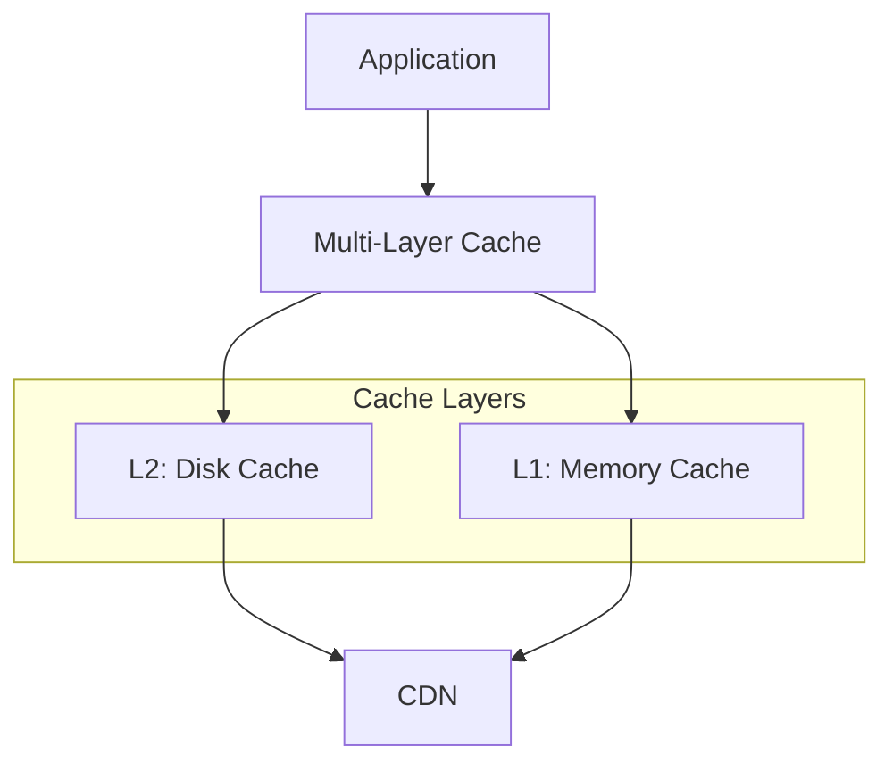
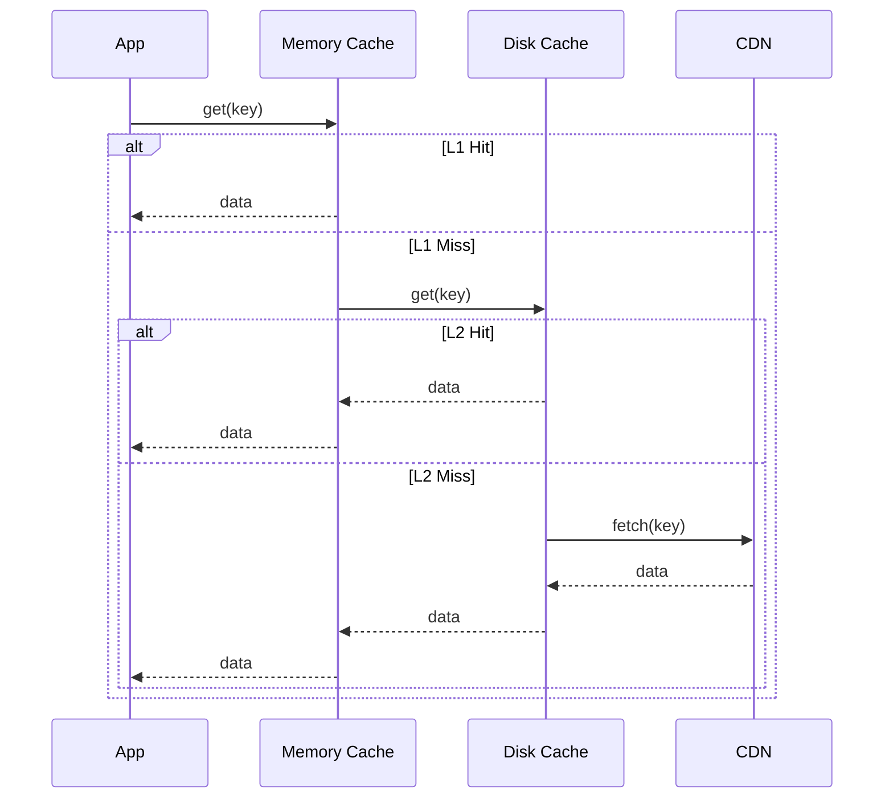

# CDN Content Caching

The `cascette-cache` crate provides multi-layer caching for NGDP/CDN content.
It optimizes network bandwidth and latency by caching frequently accessed data
at multiple levels.

## Architecture



### L1: Memory Cache

Fast in-memory cache with LRU eviction:

- Immediate access for hot data
- Size-based eviction when memory limit reached
- TTL-based expiration for stale data
- Zero-copy data sharing with `bytes::Bytes`

### L2: Disk Cache

Persistent disk cache for larger datasets:

- Survives application restarts
- Atomic writes with fsync for durability
- Configurable storage limits
- Asynchronous I/O with tokio

## NGDP-Specific Caches

The crate provides specialized caches for NGDP content types:

### Resolution Cache

Caches the NGDP resolution chain:

```
Root File → Content Key
Content Key → Encoding Key
Encoding Key → CDN Location
```

### Content-Addressed Cache

Stores content by its MD5 hash (ContentKey):

- Automatic validation on retrieval
- Deduplication across builds
- Supports partial content access

### BLTE Block Cache

Caches individual BLTE blocks for large files:

- Enables partial file access without full download
- Block-level validation
- Decompressed and raw block storage

### Archive Range Cache

Caches byte ranges from CDN archives:

- Coalesces nearby requests into larger ranges
- Reduces CDN round-trips
- Supports range request optimization

## Memory Pooling

NGDP files have predictable size distributions. The memory pool uses size
classes optimized for these patterns:

| Size Class | Range | Typical Content |
|------------|-------|-----------------|
| Small | < 16 KB | Config files, small assets |
| Medium | < 256 KB | Most game files |
| Large | < 8 MB | Textures, models |
| Huge | > 8 MB | Large archives, cinematics |

Benefits:
- Reduced allocation overhead
- Better memory locality
- Thread-local pools for zero-contention

## Content Validation

All cached content is validated on retrieval:

### MD5 Validation

Content keys are MD5 hashes of the data:

```rust
let content_key = ContentKey::from_data(&data);
// Cache validates: MD5(data) == content_key
```

### Jenkins96 Validation

Archive indices use Jenkins96 for fast hashing:

```rust
let hash = Jenkins96::hash(path.as_bytes());
// Validates archive index lookups
```

### TACT Key Validation

Encrypted content requires TACT key verification before decryption.

## SIMD Optimizations

Hash operations use SIMD acceleration when available:

| Instruction Set | Vector Width | Speedup |
|-----------------|--------------|---------|
| SSE2 | 128-bit | 2x |
| SSE4.1 | 128-bit | 2x |
| AVX2 | 256-bit | 4x |
| AVX-512 | 512-bit | 8x |

Runtime CPU detection selects the best available implementation.

## Configuration

### Memory Cache

```rust
MemoryCacheConfig {
    max_size: 256 * 1024 * 1024,  // 256 MB limit
    ttl: Duration::from_secs(3600), // 1 hour TTL
    eviction_batch_size: 100,      // Evict 100 items at a time
}
```

### Disk Cache

```rust
DiskCacheConfig {
    cache_dir: PathBuf::from("/var/cache/cascette"),
    max_size: 10 * 1024 * 1024 * 1024, // 10 GB limit
    sync_writes: true,                  // fsync after writes
}
```

### Multi-Layer

```rust
MultiLayerConfig {
    l1: MemoryCacheConfig::default(),
    l2: DiskCacheConfig::default(),
    write_through: true,  // Write to both layers
    promote_on_hit: true, // Copy L2 hits to L1
}
```

## CDN Integration

The cache integrates with CDN clients for miss handling:



Features:
- Automatic CDN fallback on cache miss
- Retry logic with exponential backoff
- Multiple CDN endpoint failover
- Range request support for partial content

## Streaming

Large files are processed in chunks to avoid memory exhaustion:

```rust
StreamingConfig {
    chunk_size: 64 * 1024,      // 64 KB chunks
    max_buffered_chunks: 16,    // 1 MB max buffer
    validate_chunks: true,      // Validate each chunk
}
```

Streaming enables:
- Processing files larger than available memory
- Progressive validation during download
- Early error detection

## Metrics

The cache tracks performance metrics:

- Hit rate (L1, L2, overall)
- Miss rate and CDN fallback frequency
- Eviction counts and reasons
- Memory and disk usage
- Validation success/failure rates

## References

- [CDN Architecture](../protocols/cdn.md)
- [BLTE Container](../compression/blte.md)
- [Archives](../formats/archives.md)
- [Local Storage](local-storage.md)
