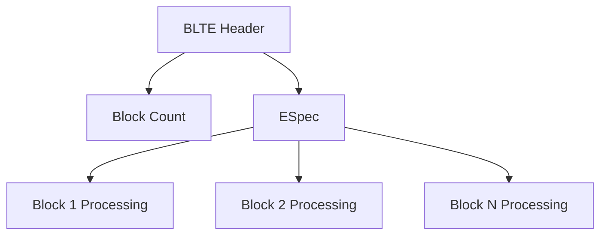

# ESpec (Encoding Specification) Documentation

## Overview

ESpec is a domain-specific language used throughout NGDP for specifying BLTE
encoding instructions. It defines how content blocks are compressed, encrypted,
and structured within BLTE containers. ESpec appears in patch configurations,
encoding files, and BLTE block headers.

## Grammar Components

ESpec uses single-character identifiers for encoding operations:

### Basic Encodings

- **n**: Plain/uncompressed data

- **z**: Zlib compression

- **e**: Encryption

- **b**: Block-based encoding

- **c**: BCPack compression

- **g**: GDeflate compression

### Encoding Combinations

ESpec supports nested and sequential encoding operations through composition.

## Block Syntax

### Size Specifications

Block sizes support unit suffixes:

- **K**: Kilobytes (1024 bytes)

- **M**: Megabytes (1024 * 1024 bytes)

- No suffix: Bytes

### Count Specifications

Block counts can be:

- **Exact number**: Specific block count (e.g., `3`)

- **Variable**: Asterisk (`*`) for variable block count

### Block Format

```text
b:{size[*count]=encoding}
```

Components:

- **size**: Block size with optional unit suffix

- **count**: Block count (optional, defaults to 1)

- **encoding**: Encoding specification for blocks

## Grammar Reference

### Simple Encodings

```text
plain := "n"
zlib := "z" [ ":" "{" level "}" ]
encryption := "e" ":" "{" key "," iv "," content_encoding "}"
```

### Block Encoding

```text
block := "b" ":" "{" block_spec "}"
block_spec := size [ "*" count ] "=" encoding
size := number [ unit ]
unit := "K" | "M"
count := number | "*"
```

### Complex Encodings

```text
encoding := plain | zlib | encryption | block | bcpack | gdeflate
bcpack := "c"
gdeflate := "g"
```

## Examples

### Simple Block Encoding

```text
b:{495=z,9673=n}
```

This specifies:

- First block: 495 bytes, zlib compressed

- Second block: 9673 bytes, uncompressed

### Variable Block Sizes

```text
b:{16K*=z}
```

This specifies:

- Variable number of 16KB blocks

- All blocks use zlib compression

### Encrypted Blocks

```text
b:{256K*=e:{key,iv,z}}
```

This specifies:

- Variable number of 256KB blocks

- Each block is encrypted with specified key and IV

- Content is zlib compressed before encryption

### Compression Levels

```text
b:{16K*=z:{6,mpq}}
```

This specifies:

- Variable number of 16KB blocks

- Zlib compression level 6

- MPQ-compatible compression settings

### Mixed Block Types

```text
b:{1K=n,4K*=z,2K=n}
```

This specifies:

- First block: 1KB uncompressed

- Variable number of 4KB zlib-compressed blocks

- Final block: 2KB uncompressed

## Zlib Compression Levels

### Level Specification

Zlib compression supports level specification:

```text
z:{level}
z:{level,variant}
```

### Standard Levels

- **0**: No compression (store only)

- **1**: Fastest compression

- **6**: Default compression (balance of speed/size)

- **9**: Maximum compression

### Variant Specifications

- **mpq**: MPQ-compatible compression settings

- **default**: Standard zlib settings

### Compression Examples

```text
z:{1}        # Fast compression
z:{9}        # Maximum compression
z:{6,mpq}    # MPQ-compatible level 6
```

## Encryption Specification

### Format

```text
e:{key,iv,content_encoding}
```

### Components

- **key**: Encryption key identifier or value

- **iv**: Initialization vector

- **content_encoding**: Encoding applied before encryption

### Key Types

Keys can be specified as:

- Literal hex values: `0123456789abcdef`

- Key identifiers: `key_name`

- Key indices: `key[0]`

### Example Encryption

```text
e:{0123456789abcdef,fedcba9876543210,z}
```

This specifies:

- Encryption key: `0123456789abcdef`

- IV: `fedcba9876543210`

- Content: zlib compressed before encryption

## BCPack Compression

### BCPack Usage

```text
c
```

BCPack compression uses proprietary algorithm optimized for specific content
types.

### Block-Based BCPack

```text
b:{64K*=c}
```

Variable 64KB blocks using BCPack compression.

## GDeflate Compression

### GDeflate Usage

```text
g
```

GDeflate is Google's Deflate implementation with optimizations.

### Block-Based GDeflate

```text
b:{32K*=g}
```

Variable 32KB blocks using GDeflate compression.

## Usage Contexts

### PatchConfig Files

ESpec appears in patch-entry lines:

```text
patch-entry = source_hash target_hash size espec
```

Example:

```text
patch-entry = 1234567890abcdef abcdef1234567890 524288 b:{16K*=z}
```

### Encoding Files

Encoding files use ESpec for content encoding specifications:

```text
content_key encoded_key size espec
```

### BLTE Data Blocks

BLTE headers contain ESpec for block processing instructions:



## Parser Implementation

### Tokenization

ESpec parsing requires tokenization of:

1. **Identifiers**: Single characters (n, z, e, b, c, g)
2. **Numbers**: Decimal integers
3. **Units**: Size suffixes (K, M)
4. **Delimiters**: Braces, colons, commas, equals, asterisks

### Grammar Rules

```rust
// Example parser structure
enum ESpec {
    Plain,
    Zlib { level: Option<u8>, variant: Option<String> },
    Encryption { key: String, iv: String, content: Box<ESpec> },
    Block { specs: Vec<BlockSpec> },
    BCPack,
    GDeflate,
}

struct BlockSpec {
    size: u64,
    count: BlockCount,
    encoding: ESpec,
}

enum BlockCount {
    Exact(u32),
    Variable,
}
```

### Error Handling

Common parsing errors:

- Invalid identifier characters

- Malformed block specifications

- Missing required parameters

- Invalid size or count values

- Unbalanced braces or parentheses

## Validation Rules

### Size Constraints

- Block sizes must be positive integers

- Maximum block size typically limited to several MB

- Minimum block size typically 1 byte

### Count Constraints

- Block counts must be positive integers when specified

- Variable count (`*`) requires size specification

- Total content size must be consistent

### Encoding Constraints

- Encryption requires valid key and IV lengths

- Compression levels must be within algorithm-specific ranges

- Nested encodings must be logically valid

## Performance Considerations

### Block Size Selection

Block sizes depend on usage:

- **Small blocks (1-4KB)**: Better for streaming, higher overhead

- **Medium blocks (16-64KB)**: Balanced performance

- **Large blocks (256KB+)**: Better compression ratios, higher memory usage

### Compression Algorithm Selection

Algorithm characteristics:

- **zlib**: Universal compatibility, good compression

- **BCPack**: Optimized for specific content types

- **GDeflate**: Fast compression with good ratios

- **None (n)**: Maximum speed, no space savings

### Memory Usage

```rust
// Example memory-efficient processing
fn process_blocks(espec: &ESpec, data: &[u8]) -> Result<Vec<u8>> {
    match espec {
        ESpec::Block { specs } => {
            let mut output = Vec::new();
            let mut offset = 0;

            for spec in specs {
                let block_data = &data[offset..offset + spec.size as usize];
                let processed = process_encoding(&spec.encoding, block_data)?;
                output.extend(processed);
                offset += spec.size as usize;
            }

            Ok(output)
        }
        // Other encoding types...
    }
}
```

## Common Patterns

### Streaming-Optimized

```text
b:{16K*=z}
```

Small, consistent block sizes for streaming applications.

### Storage-Optimized

```text
b:{1M*=z:{9}}
```

Large blocks with maximum compression for storage efficiency.

### Mixed Content

```text
b:{4K=n,64K*=z,4K=n}
```

Headers and footers uncompressed, bulk content compressed.

### Encrypted Streaming

```text
b:{32K*=e:{key,iv,z:{6}}}
```

Moderate block sizes with encryption and balanced compression.

## Debugging and Validation

### ESpec Validation

```rust
fn validate_espec(espec: &str) -> Result<ESpec, ESpecError> {
    let parsed = parse_espec(espec)?;
    validate_constraints(&parsed)?;
    Ok(parsed)
}

fn validate_constraints(espec: &ESpec) -> Result<(), ESpecError> {
    match espec {
        ESpec::Zlib { level: Some(level), .. } if *level > 9 => {
            Err(ESpecError::InvalidCompressionLevel(*level))
        }
        ESpec::Block { specs } if specs.is_empty() => {
            Err(ESpecError::EmptyBlockSpec)
        }
        // Additional validation rules...
        _ => Ok(())
    }
}
```

### Round-Trip Testing

```rust
#[test]
fn test_espec_round_trip() {
    let original = "b:{16K*=z:{6}}";
    let parsed = parse_espec(original).unwrap();
    let serialized = serialize_espec(&parsed);
    assert_eq!(original, serialized);
}
```

## Integration Examples

### BLTE Block Processing

```rust
fn process_blte_block(espec: &ESpec, input: &[u8]) -> Result<Vec<u8>> {
    match espec {
        ESpec::Plain => Ok(input.to_vec()),
        ESpec::Zlib { level, .. } => decompress_zlib(input),
        ESpec::Encryption { key, iv, content } => {
            let decrypted = decrypt(input, key, iv)?;
            process_blte_block(content, &decrypted)
        }
        ESpec::Block { specs } => process_block_specs(specs, input),
    }
}
```

### Patch Application

```rust
fn apply_patch_with_espec(
    source: &[u8],
    patch: &[u8],
    espec: &ESpec
) -> Result<Vec<u8>> {
    let processed_patch = process_blte_block(espec, patch)?;
    apply_binary_patch(source, &processed_patch)
}
```

## Reference Implementation

### Complete Parser

```rust
use nom::{
    branch::alt,
    bytes::complete::tag,
    character::complete::{alphanumeric1, char, digit1},
    combinator::{map, opt},
    multi::separated_list0,
    sequence::{delimited, preceded, separated_pair, tuple},
    IResult,
};

pub fn parse_espec(input: &str) -> IResult<&str, ESpec> {
    alt((
        parse_plain,
        parse_zlib,
        parse_encryption,
        parse_block,
        parse_bcpack,
        parse_gdeflate,
    ))(input)
}

fn parse_plain(input: &str) -> IResult<&str, ESpec> {
    map(char('n'), |_| ESpec::Plain)(input)
}

fn parse_zlib(input: &str) -> IResult<&str, ESpec> {
    map(
        tuple((
            char('z'),
            opt(preceded(
                char(':'),
                delimited(
                    char('{'),
                    separated_pair(
                        digit1,
                        opt(char(',')),
                        opt(alphanumeric1)
                    ),
                    char('}')
                )
            ))
        )),
        |(_, params)| match params {
            Some((level, variant)) => ESpec::Zlib {
                level: level.parse().ok(),
                variant: variant.map(|s| s.to_string()),
            },
            None => ESpec::Zlib { level: None, variant: None },
        }
    )(input)
}
```

## Implementation Status

### Rust Implementation (cascette-formats)

Complete ESpec parser with full specification support:

- **Plain (n)** - Uncompressed content (complete)

- **ZLib compression (z)** - With level and variant support (complete)

- **Encryption (e)** - Key, IV, and content encoding (complete)

- **Block-based (b)** - Variable and fixed block specifications (complete)

- **BCPack (c)** - Proprietary compression support (complete)

- **GDeflate (g)** - Google Deflate implementation (complete)

**Parser Features:**

- Safe integer casting with `try_from` to prevent truncation

- Display trait implementation for round-trip string conversion

- Comprehensive test suite with 6 production ESpec patterns

- Integration with BLTE and Encoding file processing

### Analysis and Validation

ESpec patterns are validated across all CASC formats to ensure correct
parsing and processing of compression and encryption specifications.

This ESpec documentation covers the encoding specification language used
throughout the NGDP system, enabling developers to parse, validate, and
implement ESpec-based content processing.
