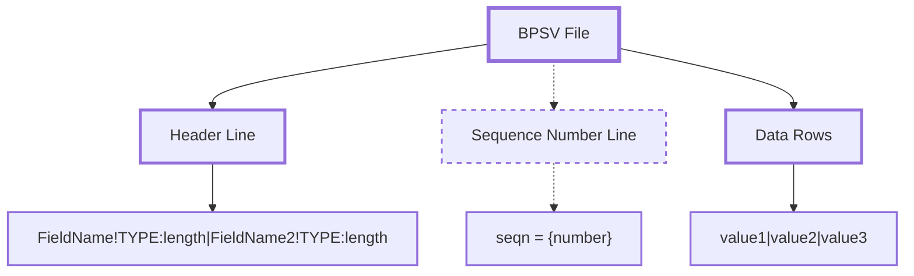
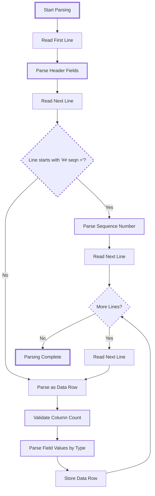

# BPSV Format Specification

BPSV (Blizzard Pipe-Separated Values) is a structured data serialization format,
similar to CSV but using pipes (|) as delimiters with Blizzard-specific schemas.
It's used in Ribbit API responses, configuration files, and version manifests.
BPSV is a data format, not a network protocol.

## Format Structure

BPSV files contain three components:

1. Header line (required)
2. Sequence number line (optional)
3. Data rows (zero or more)



## Header Line Format

The header line defines field structure using pipe-separated field definitions:

```text
FieldName!TYPE:length|FieldName2!TYPE:length|FieldName3!TYPE:length
```

Each field definition contains:

- Field name (case-sensitive)

- Exclamation mark separator

- Field type (case-insensitive)

- Colon separator

- Length specification

## Sequence Number

The optional sequence number appears on a separate line:

```text
## seqn = 12345
```

Properties:

- Always starts with `## seqn`

- Supported separators: ` = `, `:`, or space

- Contains integer value

- Used for version tracking and cache invalidation

- Maximum one per file

Accepted formats:

- `## seqn = 12345` (equals with spaces)

- `## seqn: 12345` (colon separator)

- `## seqn 12345` (space only)

- Extra whitespace is trimmed

## Field Types

BPSV supports three field types:

### STRING:length

Text data with length constraints:

- Length 0: unlimited characters

- Length > 0: maximum character count

- Type names: STRING, String, string (case-insensitive)

- UTF-8 encoding

### HEX:length

Binary data encoded as hexadecimal:

- Length specifies bytes in binary form

- Requires exactly length × 2 hexadecimal characters

- Valid characters: 0-9, a-f, A-F

- Empty values always valid

- Common usage: HEX:16 for MD5 hashes (32 hex chars)

### DEC:length

Decimal integers:

- Length indicates storage size (4 = uint32, 8 = uint64)

- Length not enforced during parsing

- Supports full int64 range

- Type names: DEC, Dec, dec (case-insensitive)

## Data Rows

Data rows contain pipe-separated values matching header field definitions:

- Column count must match header field count

- Empty values allowed for all field types

- Values parsed according to field type specifications

## Parsing Flow



## Usage Context

BPSV is a data serialization format used in multiple contexts:

- **Ribbit API Responses**: Structured data returned by Ribbit protocol

- **Product Configuration Files**: `.product` files with version information

- **Version Manifests**: Build and CDN configuration references

- **CDN Configuration**: Server URLs and path mappings

- **Background Downloads**: Download priority information

Note: BPSV is the data format; Ribbit is the protocol that transmits BPSV data.

## Implementation Requirements

### Type Validation

Parsers must validate field values according to type specifications:

- STRING fields accept any UTF-8 text

- HEX fields require valid hexadecimal characters and exact length

- DEC fields must parse as valid integers

- Empty values are valid for all field types

### Parsing Architecture

Implementations may use different parsing strategies:

- **Zero-copy parsing**: Borrow from original string for efficiency

- **Owned parsing**: Copy data for serialization/storage

- **Lazy parsing**: Keep raw strings until typed values requested

- **Schema validation**: Enforce field uniqueness and type compatibility

### Error Handling

Common parsing errors:

- Column count mismatch between header and data rows

- Invalid characters in HEX fields

- Incorrect HEX field length (must be exactly length × 2 chars)

- Non-numeric values in DEC fields

- Multiple sequence number lines

- Duplicate field names in schema

### Performance Considerations

- Typical file size: < 10MB

- Typical row count: < 10,000

- UTF-8 encoding recommended

- Both Unix (\n) and Windows (\r\n) line endings accepted

## Format Examples

### Basic Product Configuration

```text
Region!STRING:4|BuildConfig!HEX:16|CDNConfig!HEX:16
## seqn = 98765
us|a1b2c3d4e5f6789012345678|f1e2d3c4b5a69870123456789abcdef0
eu|b2c3d4e5f6789012345678a1|e2d3c4b5a69870123456789abcdef0f1
```

### CDN Server List

```text
Name!STRING:0|Path!STRING:0|Hosts!STRING:0
## seqn = 54321
us|tpr/wow|us.patch.battle.net level3.blizzard.com
eu|tpr/wow|eu.patch.battle.net level3.blizzard.com
```

### Version Information

```text
Product!STRING:10|Seqn!DEC:4|Flags!HEX:4
wow|12345|0001
wowt|12346|0002
```

## Type Casing Examples

Field types accept case variations:

```text
# All valid type specifications
Name!STRING:50|ID!DEC:4|Hash!HEX:16
Name!String:50|ID!Dec:4|Hash!Hex:16
Name!string:50|ID!dec:4|Hash!hex:16
```

## Empty Value Handling

Empty values preserve semantic meaning:

```text
Product!STRING:10|Version!STRING:10|Hash!HEX:16
wow|8.3.0|a1b2c3d4e5f6789012345678
wowt||b2c3d4e5f6789012345678a1
```

The second row contains an empty version field, which differs from a missing
field.

## Implementation Status

### Rust Implementation (cascette-formats)

BPSV parser and builder:

- **Schema parsing** - Field name, type, and size validation (complete)

- **Document parsing** - Multi-row data with sequence numbers (complete)

- **Type support** - STRING, HEX, and DEC field types (complete)

- **Round-trip validation** - parse(build(data)) == data guarantee (complete)

- **Case-insensitive types** - Accepts STRING, String, string variations
(complete)

- **Builder support** - Programmatic BPSV file creation (complete)

**Validation Status:**

- Byte-for-byte round-trip validation

- Integration tests with real Ribbit API responses

- Handles empty values, comments, and sequence numbers

- Validated against real Battle.net BPSV files

### Analysis and Usage

BPSV format is used throughout the NGDP system for configuration and version
data.
