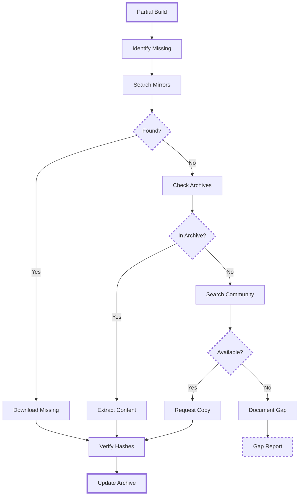

# CDN Mirroring and Archival Strategy

## Overview

This document outlines strategies for mirroring Blizzard's CDN content for WoW
using NGDP/CASC.

> **Note**: Python code examples in this document are conceptual pseudocode
> illustrating mirroring workflows. For working code, see the `cascette mirror`
> CLI command or reference implementations in [References](references.md).

## Rationale for Mirroring

Blizzard removes older builds from CDN within days to weeks of new patches
(see [Archival Urgency](#archival-urgency) below). Mirroring preserves builds
that would otherwise be lost, enabling:

- **Preservation**: Maintain access to historical builds after CDN removal
- **Development**: Test CASC implementations against known data offline
- **Performance**: Local access avoids CDN latency and bandwidth limits

## Target Products

Focus on World of Warcraft products:

| Product Code | Description | Update Frequency |
|--------------|-------------|------------------|
| wow | Retail/Live | Weekly patches |
| wowt | Public Test Realm | Frequent updates |
| wow_beta | Beta servers | Daily during beta |
| wow_classic | Classic (Wrath/Cata) | Bi-weekly |
| wow_classic_era | Classic Era (Vanilla) | Rare updates |
| wow_classic_ptr | Classic PTR | During test cycles |
| wow_classic_titan | Classic Titan (CN only, WotLK 3.80.x) | Unknown |
| wow_anniversary | Classic Anniversary (TBC 2.5.x) | Unknown |

## Archival Urgency

Based on testing CDN retention windows:

| Product | Retention Window | Archival Priority |
|---------|------------------|-------------------|
| wow (Retail) | **14-15 days** | High - Daily checks |
| wow_classic | **2-4 weeks** | Medium - Weekly checks |
| wow_classic_era | **~3 months** | Low - Monthly checks |
| wow_beta | **7-10 days** | Critical - Continuous |
| wowt (PTR) | **10-14 days** | High - Every 2-3 days |

**Critical Finding**: Retail builds disappear within 2 weeks of new patches.

## Build Discovery

Track new builds via Ribbit protocol:

### Sequence Number Monitoring

```bash
# Query summary endpoint
echo -e "v1/summary\r\n" | nc us.version.battle.net 1119

# Response includes sequence numbers
## seqn = 2241282
```

Monitor sequence number changes:

```python
async def check_for_updates():
    summary = await ribbit_client.get_summary()

    for product in summary.products:
        stored_seqn = database.get_sequence(product.name)

        if product.seqn > stored_seqn:
            # New build detected!
            await process_new_build(product)
            database.update_sequence(product.name, product.seqn)
```

### Version Information

```bash
# Get specific product versions
echo -e "v1/products/wow/versions\r\n" | nc us.version.battle.net 1119
```

## CDN Path Discovery

### Critical: Always Extract CDN Paths

```bash
# Get CDN information - NEVER hardcode paths!
echo -e "v1/products/wow/cdns\r\n" | nc us.version.battle.net 1119
```

Example response:

```text
Region!STRING:0|Hosts!STRING:0|Path!STRING:0|ConfigPath!STRING:0
us|level3.blizzard.com edgecast.blizzard.com|tpr/wow|tpr/configs/data
eu|level3.blizzard.com edgecast.blizzard.com|tpr/wow|tpr/configs/data
```

**CRITICAL**: The Path field (`tpr/wow`) must be used for URL construction:

```python
# CORRECT - Uses path from CDN response
cdn_url = f"http://{host}/{path}/data/{hash[:2]}/{hash[2:4]}/{hash}"

# WRONG - Hardcoded path
cdn_url = f"http://{host}/tpr/wow/data/{hash[:2]}/{hash[2:4]}/{hash}"
```

All WoW products use `tpr/wow` regardless of product code:

- `wow`, `wow_classic`, `wow_classic_era`, `wow_classic_titan`, `wow_anniversary` all use `tpr/wow`

- Never assume paths based on product names

## Essential Files

Priority order for archival:

### 1. Configuration Files (Critical)

- BuildConfig: Build-specific settings

- CDNConfig: CDN and archive information

- ProductConfig: Product metadata

### 2. System Files (Required)

- Encoding: Content key mappings (~500MB-2GB)

- Root: File manifest

- Install: Installation manifest

- Download: Download priority

### 3. Indices (Important)

- Archive indices (`.index` files)

- Patch indices for updates

### 4. Data Archives (Bulk)

- Archive files (`data.###`)

- Largest storage requirement

- Can be fetched on-demand

## Mirroring Architecture

### Storage Structure

```text
/mirror
├── configs/
│   └── data/
│       ├── {hash[0:2]}/
│       │   └── {hash[2:4]}/
│       │       └── {hash}
├── data/
│   ├── {hash[0:2]}/
│   │   └── {hash[2:4]}/
│   │       └── {hash}
├── indices/
│   └── *.index
└── metadata.db
```

### Database Schema

```sql
CREATE TABLE builds (
    id SERIAL PRIMARY KEY,
    product VARCHAR(50),
    build_config VARCHAR(32),
    cdn_config VARCHAR(32),
    build_name VARCHAR(100),
    detected_at TIMESTAMP,
    archived BOOLEAN DEFAULT FALSE
);

CREATE TABLE files (
    hash VARCHAR(32) PRIMARY KEY,
    size BIGINT,
    type VARCHAR(20),
    downloaded_at TIMESTAMP
);
```

## Download Strategy

### Priority-Based Downloading

```python
class MirrorStrategy:
    def __init__(self):
        self.priorities = {
            'configs': 1,      # Highest priority
            'encoding': 2,
            'root': 3,
            'install': 4,
            'indices': 5,
            'data': 10        # Lowest priority
        }

    async def mirror_build(self, build_info):
        # 1. Download configs first
        await self.download_configs(build_info)

        # 2. Get encoding file
        encoding = await self.download_encoding(build_info)

        # 3. Download indices
        indices = await self.download_indices(build_info)

        # 4. Optional: Download data archives
        if self.full_mirror:
            await self.download_archives(indices)
```

### Bandwidth Management

- Concurrent downloads: 4-8 connections

- Rate limiting: Respect CDN limits

- Retry logic: Handle transient failures

- Resume support: Continue interrupted downloads

## Incremental Updates

Track changes efficiently:

```python
async def incremental_update(product):
    current_build = await get_current_build(product)
    stored_build = database.get_latest_build(product)

    if current_build != stored_build:
        # Download only new/changed files
        new_files = await diff_builds(current_build, stored_build)
        await download_files(new_files)

        database.update_build(product, current_build)
```

## Verification

Ensure data integrity:

### Hash Verification

```python
def verify_file(filepath, expected_hash):
    actual_hash = calculate_md5(filepath)
    if actual_hash != expected_hash:
        raise IntegrityError(f"Hash mismatch: {filepath}")
```

### Archive Integrity

- Verify BLTE headers

- Check chunk checksums

- Validate encoding entries

## Storage Optimization

### Deduplication

Content-addressed storage automatically deduplicates:

```python
def store_file(content, hash):
    path = get_path_from_hash(hash)
    if not os.path.exists(path):
        # Only store if not already present
        write_file(path, content)
```

### Compression

- Keep BLTE files compressed

- Use filesystem compression for configs

- Consider archive formats for old builds

## Historical Build Recovery

### Using External Sources

1. **Community Archives**:
   - Shared build collections
   - Private archives

2. **Wayback Machine**:
   - Historical Ribbit responses
   - Cached configuration files

3. **Torrent archives**:
   - Community-shared build collections
   - Distributed preservation efforts

### Reconstruction

Rebuild missing content:



## Legal Considerations

### Fair Use

Archival under fair use principles:

- **Research**: Academic study of game development

- **Education**: Teaching game architecture

- **Preservation**: Cultural heritage of gaming

- **Non-commercial**: No monetization of archives

### Best Practices

- Respect intellectual property

- Don't distribute copyrighted content

- Use for personal/research purposes

- Cooperate with takedown requests

## Reference Implementations

For detailed analysis of NGDP/CASC reference implementations, see
[references.md](references.md).

Key implementations examined:

- **CascLib**: Complete C++ library with 10+ years of development

- **TACT.Net**: C# architecture with modular design

- **rustycasc**: Rust implementation with type safety

- **BlizzTrack**: Production monitoring with database persistence

- **blizztools**: Rust CLI for NGDP operations

- **blizzget**: C++ downloader with custom version support

- **tactmon**: Advanced C++ monitoring with template ORM

- **TACTSharp**: .NET extraction library with memory-mapped files

These implementations informed cascette-rs design for CDN interaction and content
resolution.

## Implementation Examples

### Build Tracker

```python
class BuildTracker:
    def __init__(self, products):
        self.products = products
        self.check_interval = 300  # 5 minutes

    async def run(self):
        while True:
            for product in self.products:
                await self.check_product(product)
            await asyncio.sleep(self.check_interval)

    async def check_product(self, product):
        try:
            versions = await ribbit.get_versions(product)
            cdns = await ribbit.get_cdns(product)

            for region in versions.regions:
                build_config = region.build_config
                if not self.is_archived(build_config):
                    await self.archive_build(product, region, cdns)
        except Exception as e:
            logger.error(f"Failed to check {product}: {e}")
```

### Archive Manager

```python
class ArchiveManager:
    def __init__(self, storage_path):
        self.storage = storage_path
        self.cdn_client = CDNClient()

    async def archive_build(self, build_info):
        # Create build directory
        build_dir = self.storage / build_info.product / build_info.build_config
        build_dir.mkdir(parents=True, exist_ok=True)

        # Download in priority order
        await self.download_configs(build_info)
        await self.download_encoding(build_info)
        await self.download_root(build_info)

        # Mark as archived
        self.mark_archived(build_info)
```

## Monitoring and Alerts

### Health Checks

```python
class MirrorHealth:
    async def check_health(self):
        return {
            'disk_space': self.check_disk_space(),
            'cdn_connectivity': await self.check_cdn(),
            'database': self.check_database(),
            'last_check': datetime.now()
        }

    def check_disk_space(self):
        usage = shutil.disk_usage(self.storage_path)
        return {
            'used': usage.used,
            'free': usage.free,
            'percent': (usage.used / usage.total) * 100
        }
```

## Disaster Recovery

### Backup Strategy

1. **Primary Mirror**: Fast SSD storage
2. **Secondary Backup**: HDD archive
3. **Cloud Backup**: Critical configs only
4. **Community Sharing**: Torrent distribution

### Recovery Procedures

```bash
# Restore from backup
rsync -av /backup/mirror/ /primary/mirror/

# Verify integrity
find /mirror -type f -name "*.index" | xargs -I {} md5sum {}

# Rebuild database
python rebuild_metadata.py /mirror
```

## Community Coordination

### Shared Resources

- **Mirror status**: Track who has what builds

- **Gap identification**: Find missing builds

- **Bandwidth sharing**: Distribute download load

- **Verification**: Cross-check integrity

## Future Considerations

- Automated build discovery with predictive downloading before CDN removal
- Differential compression between builds to reduce storage
- Geographic replication for redundancy

## Tools and Resources

### Existing Tools

- **CASCExplorer**: Browse CASC archives

- **WoW.tools**: Online CASC viewer

- **TACTSharp**: .NET extraction library

- **CascLib**: C++ CASC library

### Monitoring Services

- **BlizzTrack**: Real-time build tracking

- **Wago.tools**: API for build information

### Community

- **Discord servers**: Coordinate archival efforts

- **GitHub repos**: Share tools and scripts

- **Forums**: Technical discussions

The 14-15 day retention window for retail WoW makes automated monitoring and
archival essential.
