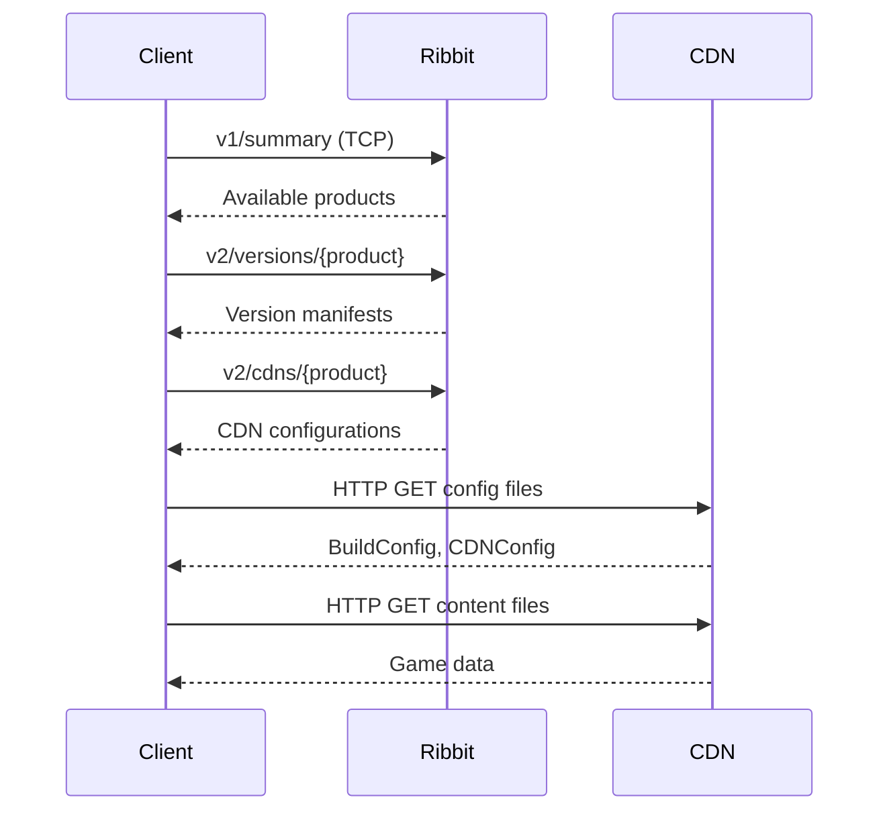
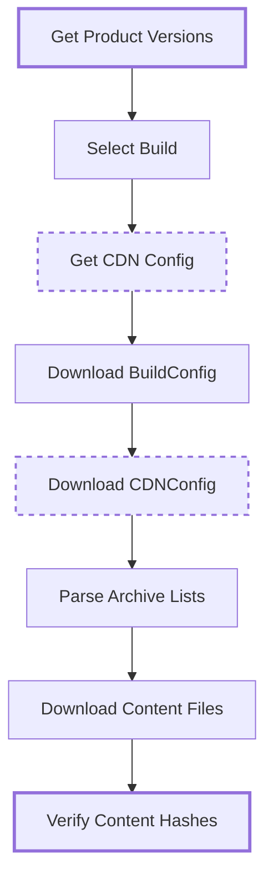
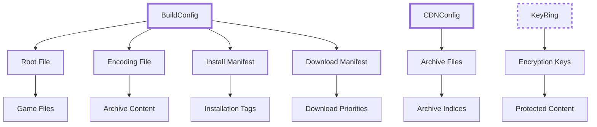

# CDN Architecture Documentation

## Overview

NGDP uses a Content Delivery Network (CDN) architecture for distributing game
content. The system provides geographical distribution of content through
HTTP/HTTPS endpoints, with automatic failover and load balancing capabilities.

> **Note**: Code examples in this document illustrate concepts. For working
> implementations, see the `cascette` CLI or the cascette-protocol crate.

## Discovery and Access Flow

### Product Discovery

Product discovery begins with a v1/summary query to the Ribbit TCP service:



### Region Selection

NGDP supports the following regions:

- `us`: United States

- `eu`: Europe

- `kr`: Korea

- `tw`: Taiwan

- `cn`: China (restricted access)

- `sg`: Singapore

### HTTPS v2 Endpoints

The v2 API provides three primary endpoints:

- **versions**: Product version information and build manifests

- **cdns**: CDN server configurations and endpoints

- **bgdl**: Background download configurations

### Configuration Retrieval Process

1. Query product versions to get current build information
2. **Retrieve CDN configurations to get the correct Path value**
3. Download BuildConfig and CDNConfig files using the Path from step 2
4. Parse configuration to locate content files
5. Begin content download from CDN servers

**CRITICAL**: Always extract the `Path` field from CDN responses. Never assume
paths based on product names. For example, all WoW products (`wow`,
`wow_classic`, `wow_classic_era`, `wow_classic_titan`, `wow_anniversary`) use
`tpr/wow` despite having different product codes.

### Content Download Workflow



## CDN URL Construction

### URL Pattern

```text
http(s)://{cdn_server}/{cdn_path}/{type}/{hash[0:2]}/{hash[2:4]}/{full_hash}
```

### Component Breakdown

- **cdn_server**: CDN hostname from the `Hosts` field (e.g.,
`level3.blizzard.com`)

- **cdn_path**: Path from the `Path` field - **MUST be extracted from CDN
response**

- **type**: Content type (`config`, `data`, `patch`)

- **hash[0:2]**: First two characters of content hash

- **hash[2:4]**: Next two characters of content hash

- **full_hash**: Complete content hash

### Path Field Extraction

The `cdn_path` MUST be obtained from the CDN configuration response:

```python
# CORRECT: Extract Path from CDN response
cdn_response = query_ribbit("v2/products/wow_classic/cdns")
cdn_path = cdn_response["Path"]  # Returns "tpr/wow"

# WRONG: Assuming path from product name
cdn_path = f"tpr/{product_name}"  # DO NOT DO THIS
```

### Path vs ProductPath Distinction

**IMPORTANT**: The CDN response contains two path fields that serve different
purposes:

- **Path** (e.g., `tpr/wow`): Used for ALL game content including:
  - Build configuration files (`/config/`)
  - CDN configuration files (`/config/`)
  - Encoding files (`/data/`)
  - Root files (`/data/`)
  - Archive files (`/data/`)
  - Patch files (`/patch/`)
  - All other game data

- **ProductPath** (e.g., `tpr/configs`): Used ONLY for:
  - Product configuration files that Battle.net agent/launcher use
  - These are JSON files containing product metadata and settings
  - Example: `http://cdn.arctium.tools/tpr/configs/data/{hash}`

**Common mistake**: Do NOT use ProductPath for build configs, CDN configs, or
any game data files. ProductPath is exclusively for Battle.net launcher product
configuration.

### Directory Sharding

The two-level directory structure (`hash[0:2]`/`hash[2:4]`) serves multiple
purposes:

- Distributes files across filesystem directories

- Reduces directory listing overhead

- Enables efficient cache invalidation

- Supports CDN edge server optimization

### Example URLs

```text
# Configuration file
http://level3.blizzard.com/tpr/wow/config/12/34/1234567890abcdef1234567890abcdef

# Game data file
http://level3.blizzard.com/tpr/wow/data/ab/cd/abcdef1234567890abcdef1234567890

# Patch data
http://level3.blizzard.com/tpr/wow/patch/56/78/567890abcdef1234567890abcdef123456
```

### Real-World Examples

Examples from wow_classic_era version 1.15.7.61582 (archived on Arctium CDN):

```text
# Build configuration (hash: ae66faee0ac786fdd7d8b4cf90a8d5b9)
http://cdn.arctium.tools/tpr/wow/config/ae/66/ae66faee0ac786fdd7d8b4cf90a8d5b9

# CDN configuration (hash: 63eee50d456a6ddf3b630957c024dda0)
http://cdn.arctium.tools/tpr/wow/config/63/ee/63eee50d456a6ddf3b630957c024dda0

# Patch configuration (hash: 474b9630df5b46df5d98ec27c5f78d07)
http://cdn.arctium.tools/tpr/wow/config/47/4b/474b9630df5b46df5d98ec27c5f78d07

# Product configuration (different path structure)
http://cdn.arctium.tools/tpr/configs/data/c9/93/c9934edfc8f217a2e01c47e4deae8454

# Encoding file (using encoding key, not content key!)
# From build config: encoding = b07b881f4527bda7cf8a1a2f99e8622e bbf06e7476382cfaa396cff0049d356b
# Must use the SECOND hash (encoding key): bbf06e7476382cfaa396cff0049d356b
http://cdn.arctium.tools/tpr/wow/data/bb/f0/bbf06e7476382cfaa396cff0049d356b

# Root file: Cannot be fetched directly!
# The root file's encoding key must be looked up in the encoding file first.
# The hash ea8aefdebdbd6429da905c8c6a2b1813 is the content key, not the encoding key.
```

Note the different path structures:

- Most files use `/tpr/wow/{type}/`

- Product configurations use `/tpr/configs/data/`

- Patch files would be under `/tpr/wow/patch/`

## Configuration Files

### BuildConfig

BuildConfig contains build-specific references to system files.

#### Modern BuildConfig Fields

**CRITICAL**: Most fields contain pairs of values: `<content-key>
<encoding-key>`

- The first hash is the content key (unencoded)

- The second hash is the encoding key (used for CDN fetches)
- **root**: Content key for the root file (lookup encoding key via encoding
file)

- **install**: Content key and encoding key pairs for install manifest

- **download**: Content key and encoding key pairs for download manifest

- **encoding**: Content key and **encoding key for the encoding file itself**

- **size**: Content key and encoding key pairs for size file

**Important**: To fetch any file except the encoding file:

1. First fetch the encoding file using its encoding key (second hash)
2. Parse the encoding file to find the target file's encoding key
3. Use that encoding key to fetch the actual file from CDN

Additional size variations:

- **size-download**: Download-specific size information

- **size-install**: Install-specific size information

#### Historical BuildConfig Fields

- **patch**: Reference to patch configuration

- **patch-config**: Patch-specific configuration

- **build-name**: Human-readable build name

- **build-uid**: Unique build identifier

- **build-product**: Product identifier

- **build-playbuild-installer**: Installer build reference

#### Example BuildConfig

```text
# Build configuration
root = 1234567890abcdef1234567890abcdef
encoding = abcdef1234567890abcdef1234567890
install = 567890abcdef1234567890abcdef123456
download = 90abcdef1234567890abcdef1234567890
size = def1234567890abcdef1234567890abcdef
build-name = 11.0.2.56421
build-product = wow
build-uid = wow_x86_64
```

### CDNConfig

CDNConfig specifies CDN server configuration and content archives.

#### Modern CDNConfig Fields

- **archives**: List of archive file content keys

#### Historical CDNConfig Fields

- **archives-index-size**: Size of archive index files

- **archive-group**: Archive grouping configuration

- **patch-archives**: Archives containing patch data

- **file-index**: File index references

- **file-index-size**: File index sizes

- **patch-file-index**: Patch-specific file indices

- **patch-file-index-size**: Patch file index sizes

#### Example CDNConfig

```text
# CDN configuration
archives = 1234567890abcdef1234567890abcdef abcdef1234567890abcdef1234567890
567890abcdef1234567890abcdef123456
archives-index-size = 1048576 2097152 4194304
```

### PatchConfig (Historical)

PatchConfig defines differential patches using ESpec encoding instructions.

#### Patch Entry Format

```text
patch-entry = {source_hash} {target_hash} {size} {espec}
```

- **source_hash**: Content key of source file

- **target_hash**: Content key of target file

- **size**: Size of resulting patch data

- **espec**: Encoding specification (see [ESpec Documentation](espec.md))

#### Example PatchConfig

```text
# Patch configuration
patch-entry = 1234567890abcdef1234567890abcdef abcdef1234567890abcdef1234567890
524288 b:{16K*=z}
patch-entry = 567890abcdef1234567890abcdef123456
90abcdef1234567890abcdef1234567890 1048576 b:{32K*=z:{6}}
```

## CDN Response Structure

### Field Definitions

- **Name**: CDN configuration identifier

- **Path**: Base path for content requests

- **Hosts**: List of CDN hostnames

- **Servers**: Legacy server configuration

- **ConfigPath**: Path to configuration files

### Special Parameters

- **maxhosts**: Maximum number of hosts to use simultaneously

- **fallback**: Fallback CDN configuration

### Example CDN Response

```text
Name!STRING:0|Path!STRING:0|Hosts!STRING:0|Servers!STRING:0|ConfigPath!STRING:0
us|tpr/wow|level3.blizzard.com edgecast.blizzard.com|http://level3.blizzard.com/ http://edgecast.blizzard.com/|tpr/configs/data
eu|tpr/wow|eu.cdn.blizzard.com|http://eu.cdn.blizzard.com/|tpr/configs/data
```

## Path Types

### Content Types

- **config**: Configuration files (BuildConfig, CDNConfig, etc.)

- **data**: Game content files and archives

- **patch**: Differential patch data

### Usage Patterns

```bash
# Configuration files
/{cdn_path}/config/{hash_dirs}/{hash}

# Game data
/{cdn_path}/data/{hash_dirs}/{hash}

# Patch data
/{cdn_path}/patch/{hash_dirs}/{hash}
```

## Implementation Requirements

### Mandatory Components

Both BuildConfig AND CDNConfig are required for proper NGDP operation:

- BuildConfig provides system file references

- CDNConfig specifies content storage locations

- Missing either file prevents content access

### CDN Path Resolution

**NEVER hardcode CDN paths**. Always follow this process:

1. Query `v2/products/{product}/cdns` endpoint
2. Parse BPSV response to extract `Path` field
3. Use extracted path for all URL construction
4. Cache path per product for session duration

```rust
// Example implementation requirement
struct CdnClient {
    // Cache paths discovered from CDN responses
    path_cache: HashMap<String, String>,
}

impl CdnClient {
    async fn get_cdn_path(&mut self, product: &str) -> Result<String> {
        if let Some(cached) = self.path_cache.get(product) {
            return Ok(cached.clone());
        }

        // Query CDN endpoint
        let response = query_ribbit(&format!("v2/products/{}/cdns", product)).await?;
        let path = response.get_field("Path")?;

        // Cache for future use
        self.path_cache.insert(product.to_string(), path.clone());
        Ok(path)
    }
}
```

### Fallback Logic

Implement fallback mechanisms:

1. **CDN Rotation**: Cycle through available CDN servers
2. **Region Fallback**: Fall back to alternate regions if available
3. **Protocol Fallback**: HTTPS preferred, HTTP as fallback
4. **Retry Logic**: Exponential backoff for failed requests

### Rate Limiting

Implement client-side rate limiting:

- Respect CDN server limitations

- Implement connection pooling

- Use appropriate request timeouts

- Avoid overwhelming CDN infrastructure

### Regional Restrictions

China (`cn`) region has special considerations:

- Limited CDN access

- Different server infrastructure

- Potential connectivity restrictions

- Require region-specific handling

## Backup Servers

### Community Mirrors

Several community-maintained mirrors provide NGDP content:

#### cdn.arctium.tools

- **Protocol**: HTTP only

- **Status**: Active

- **Coverage**: Full NGDP content mirror

#### casc.wago.tools

- **Protocol**: HTTP with HTTPS redirects

- **Status**: Active

- **Coverage**: Full NGDP mirror

#### archive.wow.tools

- **Protocol**: HTTPS

- **Status**: Active

- **Coverage**: Historical NGDP content archive

### Mirror Usage

```bash
# Primary CDN (preferred)
curl http://level3.blizzard.com/tpr/wow/data/12/34/1234567890abcdef

# Backup mirror
curl http://cdn.arctium.tools/tpr/wow/data/12/34/1234567890abcdef
```

## File Types

### Core Manifests

System files that define content structure:

- **root**: Maps file paths to content keys

- **encoding**: Maps content keys to encoded storage keys

- **install**: Defines installation requirements and file tags

- **download**: Specifies download priorities for streaming

- **size**: Contains file size information

### Storage Files

Content storage and indexing:

- **archives**: Bulk content storage containers

- **indexes**: Index files for locating content within archives

### Encryption Files

Content protection and key management:

- **KeyRing**: Encryption key storage format for protected content

### File Type Usage



## Error Handling

### HTTP Status Codes

- **200**: Successful content retrieval

- **404**: Content not found (may require fallback)

- **416**: Range not satisfiable (check request headers)

- **503**: Service unavailable (implement retry with backoff)

### Retry Strategies

```rust
// Example retry logic
async fn download_with_retry(url: &str, max_retries: u32) -> Result<Vec<u8>> {
    let mut attempts = 0;

    loop {
        match download(url).await {
            Ok(data) => return Ok(data),
            Err(e) if attempts < max_retries => {
                attempts += 1;
                let delay = Duration::from_secs(2_u64.pow(attempts));
                tokio::time::sleep(delay).await;
            }
            Err(e) => return Err(e),
        }
    }
}
```

### Content Verification

Always verify downloaded content:

1. Check HTTP response status
2. Verify content length if provided
3. Validate content hash against expected value
4. Retry from alternate CDN on mismatch

## Streaming Architecture Implementation

### Connection Pooling Architecture

```rust
/// Connection-pooled CDN client with retry logic
pub struct PooledCdnClient {
    /// Inner CDN client
    inner: CdnClient,
    /// Maximum concurrent connections
    max_connections: usize,
    /// Maximum retry attempts
    max_retries: usize,
    /// Initial retry delay
    retry_delay: Duration,
}

impl PooledCdnClient {
    /// Fetch range with exponential backoff retry logic
    pub async fn fetch_range_with_retry(
        &self,
        archive_hash: &str,
        offset: u64,
        size: u64,
    ) -> ArchiveResult<Vec<u8>> {
        let mut last_error = None;

        for attempt in 0..=self.max_retries {
            match self.inner.fetch_range(archive_hash, offset, size).await {
                Ok(data) => return Ok(data),
                Err(e) if attempt < self.max_retries && e.is_retryable() => {
                    // Exponential backoff: 100ms, 200ms, 400ms, 800ms...
                    let delay = self.retry_delay * (1u32 << attempt);
                    tokio::time::sleep(delay).await;
                    last_error = Some(e);
                }
                Err(e) => return Err(e),
            }
        }

        Err(last_error.unwrap_or_else(||
            ArchiveError::NetworkError("All retries exhausted".to_string())))
    }
}
```

### CDN Failover Mechanisms

```rust
/// Resilient archive resolver with fallback support
pub struct ResilientArchiveResolver {
    /// Primary resolver
    primary: CdnArchiveResolver,
    /// Fallback resolvers
    fallbacks: Vec<CdnArchiveResolver>,
    /// Error threshold before switching to fallback
    error_threshold: usize,
    /// Current error count (atomic for thread safety)
    error_count: AtomicUsize,
}

impl ResilientArchiveResolver {
    /// Fetch content with automatic fallback
    pub async fn fetch_content_resilient(&self, encoding_key: &[u8; 16]) -> ArchiveResult<Vec<u8>> {
        // Try primary resolver first
        match self.primary.fetch_content(encoding_key).await {
            Ok(content) => {
                // Reset error count on success
                self.error_count.store(0, Ordering::Relaxed);
                return Ok(content);
            }
            Err(e) if e.is_permanent() => return Err(e),
            Err(e) => {
                self.error_count.fetch_add(1, Ordering::Relaxed);

                // Try fallback resolvers if error threshold exceeded
                if self.error_count.load(Ordering::Relaxed) >= self.error_threshold {
                    for fallback in &self.fallbacks {
                        if let Ok(content) = fallback.fetch_content(encoding_key).await {
                            return Ok(content);
                        }
                    }
                }

                Err(e)
            }
        }
    }
}
```

### Range Request Coalescing

```rust
/// Streaming archive reader for network content
pub struct StreamingArchiveReader {
    /// CDN client for network operations
    client: Arc<PooledCdnClient>,
    /// Current archive being read
    archive_hash: String,
    /// Current offset in archive
    current_offset: u64,
    /// Remaining size to read
    remaining_size: u64,
    /// Chunk size for streaming reads (default 64KB)
    chunk_size: u64,
}

impl StreamingArchiveReader {
    /// Read next chunk with automatic coalescing
    pub async fn read_chunk(&mut self) -> ArchiveResult<Option<Vec<u8>>> {
        if self.remaining_size == 0 {
            return Ok(None);
        }

        let chunk_size = self.chunk_size.min(self.remaining_size);

        let data = self
            .client
            .fetch_range_with_retry(&self.archive_hash, self.current_offset, chunk_size)
            .await?;

        // Verify response size matches request
        if data.len() as u64 != chunk_size {
            return Err(ArchiveError::IncompleteRangeResponse {
                requested: chunk_size,
                received: data.len() as u64,
            });
        }

        self.current_offset += chunk_size;
        self.remaining_size -= chunk_size;

        Ok(Some(data))
    }

    /// Read all remaining data in one request (coalescing)
    pub async fn read_all(&mut self) -> ArchiveResult<Vec<u8>> {
        if self.remaining_size == 0 {
            return Ok(Vec::new());
        }

        let data = self
            .client
            .fetch_range_with_retry(&self.archive_hash, self.current_offset, self.remaining_size)
            .await?;

        self.current_offset += self.remaining_size;
        self.remaining_size = 0;

        Ok(data)
    }
}
```

### Circuit Breaker Pattern

```rust
/// Circuit breaker states for CDN resilience
#[derive(Debug, Clone, Copy, PartialEq, Eq)]
pub enum CircuitState {
    Closed,    // Normal operation
    Open,      // Failing fast, not attempting requests
    HalfOpen,  // Testing if service recovered
}

/// Circuit breaker for CDN endpoints
pub struct CdnCircuitBreaker {
    state: Arc<Mutex<CircuitState>>,
    failure_count: Arc<AtomicUsize>,
    failure_threshold: usize,
    timeout: Duration,
    last_failure: Arc<Mutex<Option<Instant>>>,
}

impl CdnCircuitBreaker {
    /// Execute request with circuit breaker protection
    pub async fn execute<F, T, E>(&self, request: F) -> Result<T, E>
    where
        F: Future<Output = Result<T, E>>,
        E: std::fmt::Debug,
    {
        // Check circuit state
        match *self.state.lock().unwrap() {
            CircuitState::Open => {
                // Check if timeout period has passed
                if let Some(last_failure) = *self.last_failure.lock().unwrap() {
                    if last_failure.elapsed() > self.timeout {
                        // Transition to half-open
                        *self.state.lock().unwrap() = CircuitState::HalfOpen;
                    } else {
                        return Err(/* circuit open error */);
                    }
                }
            }
            CircuitState::HalfOpen => {
                // Allow one test request
            }
            CircuitState::Closed => {
                // Normal operation
            }
        }

        // Execute request
        match request.await {
            Ok(result) => {
                // Success - reset failure count and close circuit
                self.failure_count.store(0, Ordering::Relaxed);
                *self.state.lock().unwrap() = CircuitState::Closed;
                Ok(result)
            }
            Err(error) => {
                // Failure - increment count and possibly open circuit
                let failures = self.failure_count.fetch_add(1, Ordering::Relaxed) + 1;
                if failures >= self.failure_threshold {
                    *self.state.lock().unwrap() = CircuitState::Open;
                    *self.last_failure.lock().unwrap() = Some(Instant::now());
                }
                Err(error)
            }
        }
    }
}
```

### Caching Strategy

Implement efficient caching:

- Cache configuration files with appropriate TTL

- Use content-addressed storage for game files

- Implement cache invalidation for updated content

- Support offline operation with cached content

## Security Considerations

### HTTPS Usage

- Use HTTPS for all content delivery

- Validate TLS certificates

- Use appropriate cipher suites

- Handle certificate pinning if required

### Content Integrity

- Verify all content hashes

- Reject content with mismatched hashes

- Implement checksum validation

- Handle corrupted content gracefully

### Key Management

For encrypted content:

- Securely store encryption keys

- Implement key rotation support

- Handle key expiration

- Protect keys from unauthorized access

## Binary Verification (Agent.exe, TACT 3.13.3)

Verified against Agent.exe (WoW Classic Era) using Binary Ninja on
2026-02-15.

### Confirmed Correct

| Claim | Agent Evidence |
|-------|---------------|
| CDN paths use tpr/wow pattern | Strings: "vfs-root", config field parsing confirms tpr-based paths |
| Patch URLs use patch.battle.net:1119 | String at 0x908bfc: "http://{0}.patch.battle.net:1119/{1}" |
| China region special handling | String at 0x908c24: "cn.patch.battlenet.com.cn" and 0x908c40: "cn.patch.battle.net" |
| Config/data/patch path types | Confirmed through BuildConfig field parsing (see config-formats.md verification) |
| Product config via separate path | String "tpr/configs" confirmed in agent |

### Limitations

The CDN protocol documentation describes HTTP-level behavior (URL
construction, retry logic, failover). Most of this is architectural
guidance that cannot be verified from the binary alone. The agent binary
confirms URL patterns and endpoint hostnames through string references,
but does not expose the CDN access logic in a way that verifies the
documented retry strategies, rate limiting, or circuit breaker patterns.

### Observations

1. **Patch server statistics**: Agent contains protobuf definitions for
   `PatchServerStatistics` and `PatchServiceStatistics` (source:
   `patchserverstatistics.pb.cc`), suggesting the agent tracks CDN
   performance metrics not documented here.

2. **Patch URL override**: Agent supports `patch_url_override` and
   `instructions_patch_url` settings (strings at 0x8ff83c, 0x8ffac0),
   allowing CDN endpoint overrides not mentioned in the documentation.

3. **Region hint**: Agent has a `patch_region_hint` setting (0x8ffc48)
   for guiding CDN region selection.
