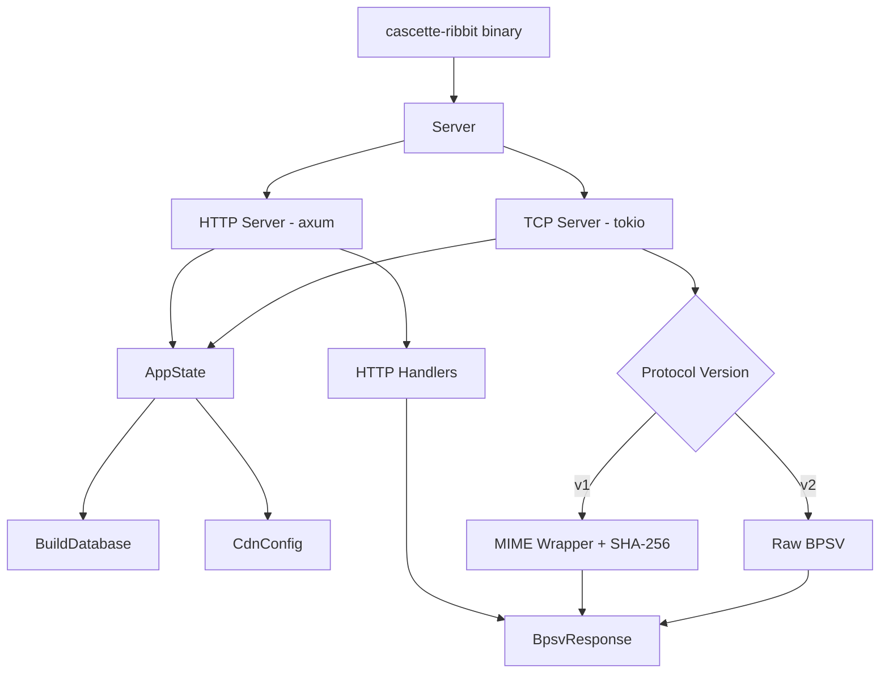

# Ribbit Server

cascette-ribbit implements a Ribbit protocol server that serves BPSV-formatted
game version and CDN configuration data over HTTP and TCP.

For protocol specification details, see [Ribbit Protocol](ribbit.md).

## Architecture



### Components

| Component | File | Purpose |
|-----------|------|---------|
| `ServerConfig` | `config.rs` | CLI arguments, env vars, TLS paths |
| `CdnConfig` | `config.rs` | CDN host/path resolution per region |
| `BuildDatabase` | `database.rs` | JSON build record storage with product indexing |
| `BuildRecord` | `database.rs` | Single build entry with MD5 hash validation |
| `AppState` | `server.rs` | Shared state (database, CDN config, timestamps) |
| `Server` | `server.rs` | Orchestrates HTTP + TCP listeners |
| `BpsvResponse` | `responses/bpsv.rs` | BPSV response builder (versions, cdns, summary) |
| HTTP handlers | `http/handlers.rs` | axum route handlers for /{product}/{endpoint} |
| TCP handlers | `tcp/handlers.rs` | Command routing for v1/ and v2/ prefixes |
| V1 wrapper | `tcp/v1.rs` | RFC 2046 MIME wrapping with SHA-256 checksums |
| V2 handler | `tcp/v2.rs` | Raw BPSV TCP responses |

## Configuration

### CLI Arguments and Environment Variables

| Flag | Env Var | Default | Description |
|------|---------|---------|-------------|
| `--http-bind` | `CASCETTE_RIBBIT_HTTP_BIND` | `0.0.0.0:8080` | HTTP listen address |
| `--tcp-bind` | `CASCETTE_RIBBIT_TCP_BIND` | `0.0.0.0:1119` | TCP listen address |
| `--builds` | `CASCETTE_RIBBIT_BUILDS` | `./builds.json` | Path to build database JSON |
| `--cdn-hosts` | `CASCETTE_RIBBIT_CDN_HOSTS` | `cdn.arctium.tools` | CDN host(s) |
| `--cdn-path` | `CASCETTE_RIBBIT_CDN_PATH` | `tpr/wow` | CDN base path |
| `--tls-cert` | `CASCETTE_RIBBIT_TLS_CERT` | none | TLS certificate path (enables HTTPS) |
| `--tls-key` | `CASCETTE_RIBBIT_TLS_KEY` | none | TLS private key path |

### Build Database Format

The server reads build records from a JSON file. Each record represents a
product build:

| Field | Type | Required | Description |
|-------|------|----------|-------------|
| `id` | u64 | yes | Unique build identifier |
| `product` | string | yes | Product code (e.g., `wow`, `wowt`) |
| `version` | string | yes | Version string (e.g., `1.14.2.42597`) |
| `build` | string | yes | Build number |
| `build_config` | string | yes | 32-char hex MD5 hash |
| `cdn_config` | string | yes | 32-char hex MD5 hash |
| `keyring` | string | no | 32-char hex MD5 hash |
| `product_config` | string | no | 32-char hex MD5 hash |
| `build_time` | string | yes | ISO 8601 timestamp |
| `encoding_ekey` | string | yes | 32-char hex encoding key |
| `root_ekey` | string | yes | 32-char hex root key |
| `install_ekey` | string | yes | 32-char hex install key |
| `download_ekey` | string | yes | 32-char hex download key |

MD5 hash fields are validated to be exactly 32 lowercase hexadecimal characters.

## HTTP Endpoints

The HTTP server uses axum with gzip compression and CORS support.

### Routes

| Route | Handler | Response |
|-------|---------|----------|
| `GET /{product}/versions` | `handle_versions` | BPSV versions table |
| `GET /{product}/cdns` | `handle_cdns` | BPSV CDN configuration |
| `GET /{product}/bgdl` | `handle_bgdl` | BPSV background download (same as versions) |

All responses use `Content-Type: text/plain; charset=utf-8`.

Returns HTTP 404 if the product is not found in the database.

## TCP Protocol

The TCP server accepts one command per connection. After sending the response,
the server closes the connection. A 10-second read timeout applies.

### V2 Commands (Raw BPSV)

- `v2/products/{product}/versions`
- `v2/products/{product}/cdns`
- `v2/products/{product}/bgdl`

### V1 Commands (MIME-wrapped)

- `v1/products/{product}/versions`
- `v1/products/{product}/cdns`
- `v1/products/{product}/bgdl`
- `v1/summary`

V1 responses wrap BPSV data in RFC 2046 MIME multipart format with a SHA-256
checksum epilogue. The server does not include PKCS#7 signatures (unlike
Blizzard's production servers).

## BPSV Response Format

### Versions Response

7 rows, one per region (us, eu, cn, kr, tw, sg, xx):

```text
Region!STRING:0|BuildConfig!HEX:16|CDNConfig!HEX:16|KeyRing!HEX:16|BuildId!DEC:4|VersionsName!STRING:0|ProductConfig!HEX:16
us|0123456789abcdef...|fedcba9876543210...|<keyring>|42597|1.14.2.42597|<product_config>
eu|...|...|...|...|...|...
...
## seqn = 1730534400
```

### CDNs Response

5 rows, one per CDN region (us, eu, kr, tw, cn):

```text
Name!STRING:0|Path!STRING:0|Hosts!STRING:0|Servers!STRING:0|ConfigPath!STRING:0
us|tpr/wow|cdn.arctium.tools|https://cdn.arctium.tools/?maxhosts=4|tpr/wow/config
...
## seqn = 1730534400
```

### Summary Response (TCP v1 only)

One row per product:

```text
Product!STRING:0|Seqn!DEC:4
wow|1730534400
wowt|1730534400
## seqn = 1730534400
```

## Running

### Binary

```bash
cargo run --bin cascette-ribbit -- --builds ./builds.json
```

### Library

```rust
use cascette_ribbit::{Server, ServerConfig};

let config = ServerConfig {
    http_bind: "127.0.0.1:8080".parse()?,
    tcp_bind: "127.0.0.1:1119".parse()?,
    builds: "./builds.json".into(),
    cdn_hosts: "cdn.arctium.tools".to_string(),
    cdn_path: "tpr/wow".to_string(),
    tls_cert: None,
    tls_key: None,
};

config.validate()?;
let server = Server::new(config)?;
server.run().await?;
```

### Example

```bash
cargo run --example simple_server
```

Then test with:

```bash
# HTTP
curl http://localhost:8080/wow/versions
curl http://localhost:8080/wow/cdns

# TCP v2
echo "v2/products/wow/versions" | nc localhost 1119

# TCP v1
echo "v1/products/wow/versions" | nc localhost 1119
```

## Testing

The crate has four test suites:

| Suite | File | Coverage |
|-------|------|----------|
| HTTP integration | `tests/http_test.rs` | HTTP endpoints, status codes, BPSV format |
| TCP v1 integration | `tests/tcp_v1_test.rs` | MIME wrapping, checksums, summary |
| TCP v2 integration | `tests/tcp_v2_test.rs` | Raw BPSV over TCP, connection lifecycle |
| Contract tests | `tests/contract_test.rs` | cascette-protocol client against server |

Contract tests verify that cascette-protocol's `RibbitTactClient` can query the
server and parse responses correctly. This ensures wire-level compatibility
between client and server implementations.

```bash
cargo test -p cascette-ribbit
cargo bench -p cascette-ribbit
```

## TLS Support

Enable TLS with the `tls` feature flag:

```bash
cargo run --bin cascette-ribbit --features tls -- \
  --tls-cert /path/to/cert.pem \
  --tls-key /path/to/key.pem
```

When TLS is enabled, the HTTP server serves HTTPS. The TCP server is not
affected (Ribbit TCP does not use TLS).
