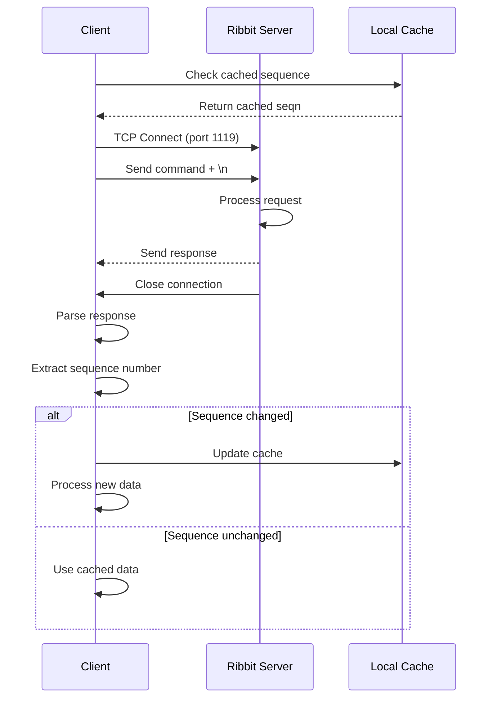
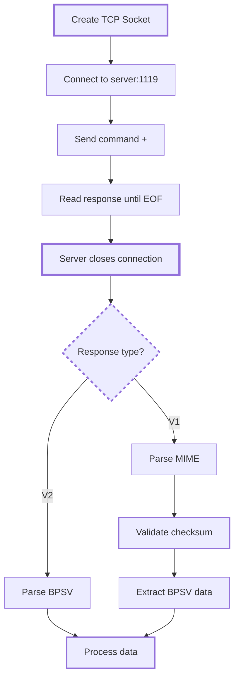
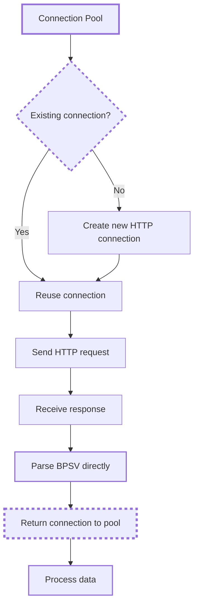
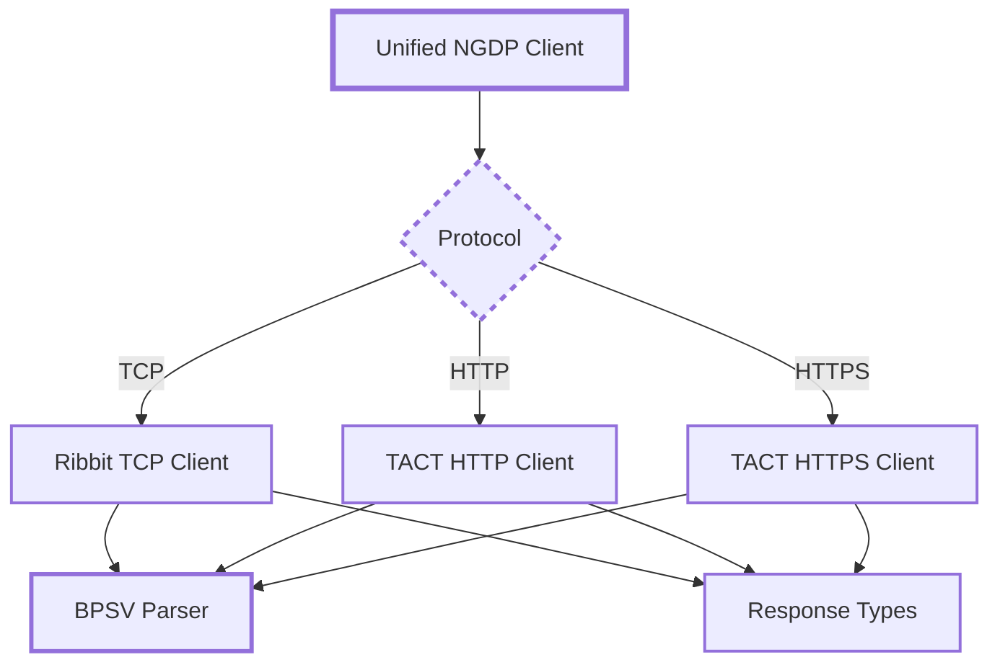

# Ribbit Protocol

Ribbit is a TCP-based protocol operating on port 1119 that serves as the
discovery
mechanism for NGDP. It provides version information, CDN endpoints, and
configuration data for Blizzard products.

## Protocol Variants

Ribbit has three access methods:

### TCP Ribbit

Direct TCP connection to `tcp://{region}.version.battle.net:1119`

- **V1 Protocol**: MIME-formatted responses with ASN.1 signatures and SHA-256
checksums

- **V2 Protocol**: Raw BPSV responses without metadata

- **Endpoints**: summary, products, certificates, and OCSP

### HTTP TACT v1

HTTP wrapper at `http://{region}.patch.battle.net:1119`

- **Endpoints**: `/{product}/versions`, `/{product}/cdns`, `/{product}/bgdl`

- **Response format**: BPSV directly without MIME wrapping

- **No authentication**: Public access

- **Connection pooling**: Reusable HTTP connections

### HTTPS TACT v2

Secure wrapper at `https://{region}.version.battle.net` (standard HTTPS port 443)

- **Same endpoints as HTTP TACT v1**

- **TLS encryption**: Standard HTTPS security

- **HTTP/2 support**: Multiplexing for concurrent requests

- **Response format**: BPSV directly

## Protocol Flow



## Endpoints

### Endpoint Comparison

| Endpoint | TCP Ribbit | HTTP TACT v1 | HTTPS TACT v2 |
|----------|------------|---------------|---------------|
| Summary | `v1/summary` | ✗ | ✗ |
| Product versions | `v1/products/{product}/versions` | `/{product}/versions` | `/{product}/versions` |
| CDN config | `v1/products/{product}/cdns` | `/{product}/cdns` | `/{product}/cdns` |
| Background download | `v1/products/{product}/bgdl` | `/{product}/bgdl` | `/{product}/bgdl` |
| Certificates | `v1/certs/{id}` | ✗ | ✗ |
| OCSP | `v1/ocsp/{id}` | ✗ | ✗ |

### Response Format Comparison

| Protocol | Response Format | Signature | Checksum |
|----------|----------------|-----------|----------|
| TCP Ribbit V1 | MIME multipart with BPSV | PKCS#7/CMS | SHA-256 |
| TCP Ribbit V2 | Raw BPSV | None | None |
| HTTP TACT v1 | Raw BPSV | None | None |
| HTTPS TACT v2 | Raw BPSV | None | None |

Note: The certificate and OCSP endpoints were part of Blizzard's custom PKI
infrastructure, now replaced by system trust stores.

## Certificate and Signature Verification

### V1 Signature Structure

V1 responses include PKCS#7/CMS signatures for authenticity:

#### SignedData Structure

- **Content Type**: PKCS#7 SignedData (OID: 1.2.840.113549.1.7.2)

- **Signer Identification**: IssuerAndSerialNumber or SubjectKeyIdentifier

- **Certificates**: Embedded in CertificateSet or fetched via SKI

- **Signed Attributes**: Optional, DER-encoded as SET for verification

#### Supported Algorithms

**Digest Algorithms:**

- SHA-256 (OID: 2.16.840.1.101.3.4.2.1)

- SHA-384 (OID: 2.16.840.1.101.3.4.2.2)

- SHA-512 (OID: 2.16.840.1.101.3.4.2.3)

**Signature Algorithms:**

- RSA with SHA-256 (OID: 1.2.840.113549.1.1.11)

- RSA with SHA-384 (OID: 1.2.840.113549.1.1.12)

- RSA with SHA-512 (OID: 1.2.840.113549.1.1.13)

### Verification Process

#### Basic Flow

1. **Extract Signature**: From MIME part with `Content-Disposition: signature`
2. **Parse PKCS#7 Structure**: Extract SignedData from ContentInfo
3. **Identify Signer**: Match via IssuerAndSerialNumber or SubjectKeyIdentifier
4. **Extract Public Key**: From embedded certificate or fetch via endpoint
5. **Verify Signature**: Process depends on signed attributes presence
6. **Validate Checksum**: SHA-256 of content matches epilogue

#### Signed Attributes Processing

When signed attributes are present (typical case):

1. **Re-encode as DER SET**:
   - Convert from implicit [0] to SET OF (tag 0x31)
   - Sort attributes in DER canonical order
   - Apply proper DER length encoding

2. **Verify Against SET**:
   - Signature verifies the DER-encoded SET
   - Message digest attribute must match content hash

3. **Without Signed Attributes**:
   - Signature directly verifies message content
   - Direct RSA verification of content hash

#### RSA Verification Details

- **Padding Scheme**: PKCS#1 v1.5

- **Key Format**: Parse SubjectPublicKeyInfo to extract RSA public key

- **Signature Format**: Raw signature bytes converted to RSA signature object

- **Hash Algorithms**: SHA-256, SHA-384, or SHA-512 based on OID

### Certificate Fetching

When certificates are not embedded:

- Extract Subject Key Identifier from signer info

- Request certificate via `/v1/certs/{ski}` endpoint

- Validate SKI matches between signature and certificate

- Extract public key for verification

### Implementation Strategies

**Parsing Approaches:**

- Primary: Use ASN.1/CMS parsing libraries

- Fallback: Pattern-based manual parsing for compatibility

- Handle both embedded and detached signatures

**Key Extraction:**

- Parse SubjectPublicKeyInfo structure

- Extract RSA public key in PKCS#1 format

- Determine key size from modulus length

**Critical Implementation Details:**

- **SET Encoding**: Signed attributes MUST be re-encoded as DER SET for
verification

- **Canonical Ordering**: Attributes sorted for DER canonical form

- **Dual Verification Paths**: Different handling for signed vs unsigned
attributes

- **Base64 Detection**: Signatures may be binary or base64-encoded in MIME

**Error Handling:**

- Invalid ASN.1 structures

- Missing or mismatched certificates

- Unsupported algorithms

- Signature verification failures

- DER encoding errors

## Regional Servers

Available regions for `{region}.version.battle.net`:

- `us` - United States

- `eu` - Europe

- `kr` - Korea

- `tw` - Taiwan

- `sg` - Singapore

- `cn` - China (restricted to China-only access)

## BPSV Format

Blizzard Pipe-Separated Values (BPSV) is the data format for responses:

### Structure

1. **Header line**: Column names with type annotations
2. **Data lines**: Pipe-separated values
3. **Sequence line**: `## seqn = {number}` (exact format with spaces required)

### Data Types

- `STRING:0` - Variable-length string

- `HEX:16` - 16-byte hexadecimal value (MD5 hash)

- `DEC:4` - 4-byte decimal integer

### Example

```text
Region!STRING:0|BuildConfig!HEX:16|CDNConfig!HEX:16|BuildId!DEC:4|VersionsName!String:0
us|be2bb98dc28aee05bbee519393696cdb|fac77b9ca52c84ac28ad83a7dbe1c829|61491|11.1.7.61491
eu|be2bb98dc28aee05bbee519393696cdb|fac77b9ca52c84ac28ad83a7dbe1c829|61491|11.1.7.61491
## seqn = 2241282
```

## V1 MIME Response Structure

TCP Ribbit V1 responses use MIME multipart format:

```text
MIME-Version: 1.0
Content-Type: multipart/alternative; boundary="{boundary}"

--{boundary}
Content-Type: text/plain
Content-Disposition: data

[BPSV data here]

--{boundary}
Content-Type: application/octet-stream
Content-Disposition: signature

[ASN.1 signature data]

--{boundary}--
Checksum: {64-character SHA-256 hash}
```

The checksum validation process:

- Search for "Checksum: " pattern at end of response

- Extract 64-character hexadecimal checksum

- Compute SHA-256 hash of content before checksum line

- Compare with provided checksum (case-insensitive)

## Connection Handling

### TCP Ribbit Connection Flow



### HTTP/HTTPS TACT Connection Flow



Key differences:

- **TCP**: New connection per request, server closes after response

- **HTTP/HTTPS**: Connection pooling, keep-alive, multiple requests per
connection

## Unified Client Architecture

### Protocol Abstraction

A unified client should abstract protocol differences:



### Common Interface

All protocol variants share common operations:

- Get product versions

- Get CDN configurations

- Get background download info

- Parse BPSV responses

### Protocol-Specific Features

**TCP Ribbit Only:**

- Summary endpoint

- Certificate/OCSP endpoints

- MIME response parsing

- Signature verification

**HTTP/HTTPS TACT Only:**

- Connection pooling

- HTTP/2 multiplexing

- Standard HTTP features

### Configuration Requirements

**Host Configuration:**

- Default hosts: `{region}.version.battle.net` or `{region}.patch.battle.net`

- Custom hosts: Support for private servers or testing

- Port configuration: 1119 for TCP/HTTP, 443 for HTTPS

**Connection Settings:**

- Timeout configuration (connect, read, total)

- Retry logic (count, backoff, jitter)

- Pool settings (max connections, idle timeout)

- HTTP/2 settings (multiplexing, window size)

## Implementation Requirements

### TCP Client

- Create new connection per request (no pooling)

- Send ASCII command terminated with `\n`

- Read response until server closes connection

- Default connection timeout: 10 seconds

### Retry Logic

Production implementations should include retry logic:

- **Default**: 0 retries for backward compatibility

- **Exponential backoff**: 100ms initial, 10s maximum, 2x multiplier

- **Jitter**: 10% randomization to prevent thundering herd

- **Retryable**: Connection, timeout, network failures

- **Non-retryable**: Parse errors, validation failures

### DNS Caching

Implementations may cache DNS lookups:

- **TTL**: 300 seconds (5 minutes) typical

- **Multiple IPs**: Try all resolved addresses sequentially

- **Thread-safe**: Concurrent access protection required

### Response Parsing

- V1: Parse MIME structure, validate SHA-256 checksum

- V2/HTTP/HTTPS: Parse BPSV directly

- Handle empty responses (headers without data rows)

- Parse typed column headers correctly

### Caching

- Cache responses with key: `{endpoint}-{arguments}-{sequence_number}`

- Check sequence numbers to detect updates

- Sequence numbers only increase (never decrease)

- Skip re-downloading if sequence unchanged

## Product Identifiers

Common product identifiers used with Ribbit:

### World of Warcraft

- `wow` - Retail

- `wow_beta` - Beta

- `wow_classic` - Classic

- `wow_classic_era` - Classic Era

- `wow_classic_ptr` - Classic PTR

- `wow_classic_titan` - Classic Titan (CN region only, WotLK 3.80.x with upgraded Classic/TBC raids)

- `wow_anniversary` - Classic Anniversary (TBC 2.5.x, progression through Classic branches on a shortened timeline)

- `wowt` - Public Test Realm

- `wowz` - Internal/Development

### Other Products

- `agent` - Battle.net Agent

- `bna` - Battle.net Application

## Version Response Fields

| Field | Type | Description |
|-------|------|-------------|
| Region | STRING:0 | Region identifier |
| BuildConfig | HEX:16 | Build configuration hash |
| CDNConfig | HEX:16 | CDN configuration hash |
| KeyRing | HEX:16 | Encryption keys hash |
| BuildId | DEC:4 | Build number |
| VersionsName | String:0 | Version string |
| ProductConfig | HEX:16 | Product configuration hash |

## CDN Response Fields

| Field | Type | Description |
|-------|------|-------------|
| Name | STRING:0 | CDN name |
| Path | STRING:0 | Base path for content |
| Hosts | STRING:0 | Space-separated host list |
| Servers | STRING:0 | Full URLs with parameters |
| ConfigPath | STRING:0 | Path to configuration files |

## Error Handling

### Connection Errors

- **Connection timeout**: Implement 10-30 second timeout (not automatic)

- **CN region**: Only accessible from within China (will timeout from elsewhere)

- **Network failures**: TCP connection may fail or drop

### Response Errors

- **Empty responses**: Some endpoints return headers only (especially bgdl)

- **404 errors**: Not all products have all endpoints

- **Malformed MIME**: V1 responses may have invalid structure

- **Invalid checksum**: V1 checksum validation may fail

- **Buffer overflow**: No standard response size limit

### Parsing Errors

- **Type inconsistency**: Handle `String:0` vs `STRING:0` in BPSV

- **Column mismatch**: Data rows may not match header count

- **Invalid sequence format**: Must match `## seqn =` exactly (with space after
equals)

- **Escaped characters**: Pipe characters in values not escaped

## Implementation Notes

### Buffer Management

- Use appropriate buffer sizes for TCP reads (typically 4KB-8KB)

- Stream responses to avoid loading entire response in memory

- No standard maximum response size - implement limits as needed

### MIME Parsing Complexity

- V1 MIME parsing requires multipart message handling

- Consider using established MIME libraries

- First chunk typically contains BPSV data

- Signature chunk identified by Content-Disposition header
